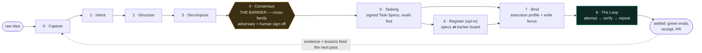

<div align="center">

# Converge

**Spec-first delivery for coding agents — `done` is decided by runnable evals, not claimed by the agent.**

[](https://github.com/luanmorenommaciel/converge/actions/workflows/ci.yml)
[](https://github.com/luanmorenommaciel/converge/releases/latest)
[](#requirements)
[](LICENSE)

One method (nine passes) · one referee CLI (`cvg`) · eleven portable skills · zero dependencies

[Quickstart](#-60-second-quickstart) ·
[How it works](#-how-it-works) ·
[Install](#-install-options) ·
[The passes](#-the-nine-passes) ·
[The CLI](#-the-cvg-cli) ·
[Docs](#-documentation)

</div>

---

## What is Converge?

Whatever coding agent you use — Claude Code, Codex, Kimi — Converge makes it work against
**signed task specs whose completion is enforced by evals, not by the agent's word**. Every task
ships with runnable bash evals authored *before* the work; a task only settles when those evals
exit green, and an adversarial judge from a **different model family** can be asked to refute the
result against holdout criteria the builder never saw.

The unit of work is the **Task-Spec**: a self-verifying markdown file with a machine-checked
format, an effort budget, an HMAC sign-off seal, and its own definition of done. The `cvg` CLI is
the **referee** around it — it frames, dispatches, and gates, but holds **zero model
credentials** and never writes a line of product code. Agents play; the referee scores.

Nine gated passes take a raw idea to merged, proven work. Each pass is an installable skill,
each gate prints one greppable token, and the whole surface is plain bash + stdlib Python — no
npm, no pip, nothing to authenticate.

## Why it's different

- **The eval decides done.** A task cannot settle until its evals exit 0 — completion is a
  state-machine invariant, not an agent's claim. The maximal stub attack (all nine specs faked)
  lands all nine RED.
- **The referee is never a player.** `cvg` holds no API keys and calls no models. Engine CLIs
  authenticate themselves; the referee only frames, dispatches headlessly, and gates.
- **Cross-family verification.** Tier-2 acceptance sends the diff, the intent, and **holdout
  criteria the builder never saw** to a different vendor's model, prompted to refute. Proven
  live in both directions — including one REFUTED verdict that caught a fail-open bug green
  evals could not see.
- **A loop with brakes.** `cvg loop` runs attempt → verify → repeat under three-axis budgets
  (iterations · wall-clock · tokens), a stagnation detector, and eight named terminal states —
  only `SETTLED`, `LOCAL_SETTLED`, and `NO_OP` exit zero. An exhausted budget is never a success.
- **Agent-agnostic by construction.** Engines are one adapter file each. The same signed spec
  dispatches to Claude Code, Codex, or Kimi — and the gate that scores the work is identical.

## ⚡ 60-second quickstart

**Inside Claude Code** — two commands, no clone, no package manager:

```
/plugin marketplace add luanmorenommaciel/converge
/plugin install converge@cvg
```

That ships all eleven skills **and** puts the `cvg` CLI on the session's PATH. Or, from any
terminal, the one-line install pins skills + CLI into the current repo:

```bash
curl -fsSL https://raw.githubusercontent.com/luanmorenommaciel/converge/main/install.sh | bash
```

Then, in the repository you want to deliver into:

```bash
cvg init                       # tracked control plane: .cvg/gate.yaml + cvg/ workspace
cvg setup signing              # repo-private HMAC key — specs become signable
cvg setup                      # readiness board: workspace · signing · engines · tracker
cvg version                    # → cvg 0.1.0 (task-spec 0.1.0)
```

And drive one task through the smallest full loop:

```bash
cvg lane "add a health endpoint"          # route the work: FAST | NORMAL | FULL
cvg tasks new add-health-endpoint XS      # author the spec (evals first)
cvg tasks validate cvg/tasks/T-*.md       # structural + six-tier sizing gate
cvg tasks gate --stamp cvg/tasks/T-*.md   # sign-off: VERDICT + HMAC seal
cvg bind --task cvg/tasks/T-*.md          # Pass 7: execution profile + guards
cvg loop --issue T-... --agent claude     # attempt → verify → repeat → TASK_LOOP=…
```

Every command ends in one stable token (`CVG_INIT=OK`, `TIER=1`, `TASK_LOOP=SETTLED`, …), so a
harness never parses prose. Agents can discover the whole surface in one call: `cvg agent-context`.

## 🔁 How it works

A raw idea descends through nine gates; the only human sign-off after Consensus is the two-gate
approval you already gave. Work settles when evals — and optionally a cross-family judge — say so.



Design flows down, evidence flows back. Passes 0–4 are the **design half** (documents, ADRs,
swimlanes, adversarial review). Pass 5 is the **cornerstone**: intent becomes signed, portable,
self-verifying Task-Specs. Passes 6–8 are the **machine half**: the board mirrors the backlog,
the bind emits an enforceable contract per task, and the loop drives each task to a terminal
state a script can read.

## 🧩 The nine passes

| Pass | Name | Skill | Gate token |
|:--:|---|---|---|
| 0 | Capture *(optional)* | [`idea-to-brd`](skills/idea-to-brd/) | `CHECK_BRD=PASS` |
| 1 | Intent | [`brd-docs-to-tech-req`](skills/brd-docs-to-tech-req/) | `CHECK_TECH_SPEC=PASS` |
| 2 | Structure | [`tech-req-to-adrs`](skills/tech-req-to-adrs/) | `CHECK_ADR=OK` |
| 3 | Decompose | [`reqs-to-swimlane-plans`](skills/reqs-to-swimlane-plans/) | `CHECK_PLAN=OK` |
| 4 | **Consensus — the barrier** | [`sketch-plans-adversarial-review`](skills/sketch-plans-adversarial-review/) | `CHECK_CONSENSUS=OK` |
| 5 | **Tasking — the cornerstone** | [`task-spec`](skills/task-spec/) | `TIER=1` |
| 6 | Register *(opt-in)* | [`task-specs-to-issues`](skills/task-specs-to-issues/) | `CHECK_REGISTER=OK` |
| 7 | Bind | [`task-to-runtime-contract`](skills/task-to-runtime-contract/) | `CHECK_RUNTIME_CONTRACT=PASS` |
| 8 | The Loop | [`task-loop`](skills/task-loop/) | `TASK_LOOP=SETTLED` |

Two utility skills round out the eleven: [`pass-to-lesson`](skills/pass-to-lesson/) (teach what a
pass just did) and [`skill-creator`](skills/skill-creator/) (author + validate new skills).
The full catalog with per-skill detail lives in [`skills/README.md`](skills/README.md).

Not every change earns all nine passes. `cvg lane` routes work to the ceremony it deserves —
FAST (5, 7, 8), NORMAL (1, 2, 5, 7, 8), or FULL (0–8) — and it **routes but never waives**:
nothing irreversible rides FAST, and no lane dispatches an unsigned spec.

## 🛠 The `cvg` CLI

The referee. Wraps every gate as a byte-exact pass-through, adds discovery, and speaks machine:

```bash
cvg init · capture · intent · structure · decompose · review · lane        # design half
cvg tasks new|validate|gate|accept|dod|metrics · eval · lint · ready       # the cornerstone
cvg register · bind · verify · loop · gate · transition                    # machine half
cvg setup [signing|tracker|key|repo|identity|projection|harness|engines]   # guided setup
cvg doctor · version · agent-context                                       # meta
```

- **`--json`** (any position) wraps any command in a uniform envelope; **`--dry-run`** previews a
  mutation. Exit codes are contracts with a published retryable/side-effects taxonomy.
- **`cvg agent-context`** emits the full machine-readable manifest — one call replaces N help
  round-trips for an agent.
- The complete surface ledger — every command, what it wraps, and what proved it — is
  [`bin/README.md`](bin/README.md).

## 📦 Install options

### 1 · Claude Code plugin marketplace *(recommended)*

Ships the eleven skills **and** the `cvg` CLI over git — global across your projects, no
package manager, nothing to authenticate:

```
/plugin marketplace add luanmorenommaciel/converge
/plugin install converge@cvg
```

Restart the session (or `/reload-plugins`), then run `cvg init` once in each repo that owns a
backlog. Skills appear namespaced (e.g. `/converge:task-spec`).

### 2 · One-line install *(any terminal, any agent)*

Pins skills + CLI into the current repository — for Codex and Kimi (`.agents/skills/`) as well
as Claude Code (`.claude/skills/`):

```bash
curl -fsSL https://raw.githubusercontent.com/luanmorenommaciel/converge/main/install.sh | bash
```

Pin an exact release with `CVG_REF=v0.1.0`, or install from a fork with `CVG_REPO_URL=<url>`.
On Windows, run it in Git Bash or WSL and use real `curl` (`curl.exe`, not the PowerShell alias).

### 3 · From a checkout *(development)*

```bash
git clone https://github.com/luanmorenommaciel/converge.git
cd ~/my-project && bash /path/to/converge/install.sh            # --symlink for live development
```

`install.sh --help` lists every flag (`--target`, `--no-bin`, `--bin-dir`, `--force`, …).
Installing is idempotent, never writes a credential, and verifies the installed skills parse
before reporting `INSTALL=OK`.

### Requirements

`bash` 3.2+ and `git` — that's the core. The binding/verification gates use `python3`
(stdlib only, no pip). Model engine CLIs (`claude`, `codex`, `kimi`) are needed only for the
passes that dispatch to them, and each authenticates itself — Converge never holds a key.

## 🧾 Status

**Converge 0.1.0** ships the CLI, eleven skills, and the Task-Spec engine as one versioned unit —
the first release where every claim has a receipt behind it:

- **CI is public and green on macOS (bash 3.2) and Linux** — 21 hermetic suites, no secrets, no
  live services: [the gauntlet](.github/workflows/ci.yml).
- **The clean-room acceptance suite** builds an empty repo, installs pinned copies for all three
  engines, and proves the full chain — init → sign → bind → bounded RED→GREEN loop → acceptance →
  receipt hash chain — with a stub engine: [`tests/test-clean-room-install-e2e.sh`](tests/test-clean-room-install-e2e.sh).
- **The loop kernel is proven by 52 hermetic checks** (brakes, stagnation, exhaustion, resume,
  cancel, honest no-op): [`tests/test-loop-kernel.sh`](tests/test-loop-kernel.sh).
- **Tier-2 verification has graded real work in both directions** — cross-family, no shared
  vendor: one UPHELD (settled through a merged PR), one **REFUTED** that caught a fail-open bug
  the deterministic evals could not see. *A green eval is necessary, not sufficient — demonstrated.*
- One number, everywhere: `VERSION` is the single source of truth and
  [`tests/test-version-unity.sh`](tests/test-version-unity.sh) fails the build on drift.

What's deliberately **not** in 0.1.0: the Manager (fleet dispatch across ready tasks — the loop
is single-task by design today) and the CI eval-gate (server-side re-verification). Both are next
on the roadmap; full history in the [CHANGELOG](CHANGELOG.md).

## 📚 Documentation

| Read | For |
|---|---|
| [`docs/converge-v0.1.pdf`](docs/converge-v0.1.pdf) | **the canonical blueprint** — the descent, the barrier, the architecture, the agent protocol |
| [`docs/task-spec-v0.1.pdf`](docs/task-spec-v0.1.pdf) | the cornerstone unit in depth — six tiers, dual gates, anti-reward-hacking |
| [`presentation/converge.html`](presentation/converge.html) | interactive walkthrough — method, trust chain, evidence model |
| [`presentation/task-spec.html`](presentation/task-spec.html) | Task-Spec anatomy, authoring, signing, execution, recovery |
| [`presentation/cvg-passes-skills-cli.html`](presentation/cvg-passes-skills-cli.html) | all nine passes, eleven skills, and the CLI, step by step |
| [`presentation/asd-agentic-loop.html`](presentation/asd-agentic-loop.html) | the agentic loop: bounded autonomy and settlement |
| [`skills/README.md`](skills/README.md) | the skill catalog — what each pass ships and gates |
| [`bin/README.md`](bin/README.md) | the CLI surface ledger — every command and what proved it |

## ❓ FAQ

<details>
<summary><b>Does my agent have to support Converge?</b></summary>

No. Skills install as plain markdown + scripts for Claude Code, Codex, and Kimi; the CLI is plain
bash. Any harness that can run shell commands can drive the gates, and `cvg agent-context` gives
an agent the full surface as JSON in one call.
</details>

<details>
<summary><b>Why signed specs?</b></summary>

The sign-off HMAC seals the eval bodies at the moment a human said "safe to delegate". If an
agent (or anyone) edits an eval afterwards to make it pass, the seal breaks and the gate refuses.
Hand-stamping is rejected; the only path to autonomy is through the gate.
</details>

<details>
<summary><b>What's the "Manager", and why isn't it a skill?</b></summary>

The Manager decides *which* task runs, when, in parallel, watching PRs — an orchestration layer a
Git-native world mostly provides already (Actions as scheduler, the PR as settlement, branch
protection as the gate). Converge ships the execution **Loop** now; the Manager schedules around
it later in CI/CD. It's the top item on the roadmap.
</details>

<details>
<summary><b>Can I use it on an existing repository?</b></summary>

Yes — `cvg init` is non-clobbering and the write fence (`.cvg/gate.yaml`) is a tracked file you
review like any other. Start with `cvg lane` on your next change; nothing forces the full descent.
</details>

## Provenance

Converge practices what it enforces: this repository's own backlog was driven through the loop —
nine tasks settled through merged PRs, one fully unattended — and its CI runs the same gates it
asks of everyone else. Built with Claude Code, Codex, and Kimi in all three seats.

## License

[MIT](LICENSE) — one license for the whole unit.
