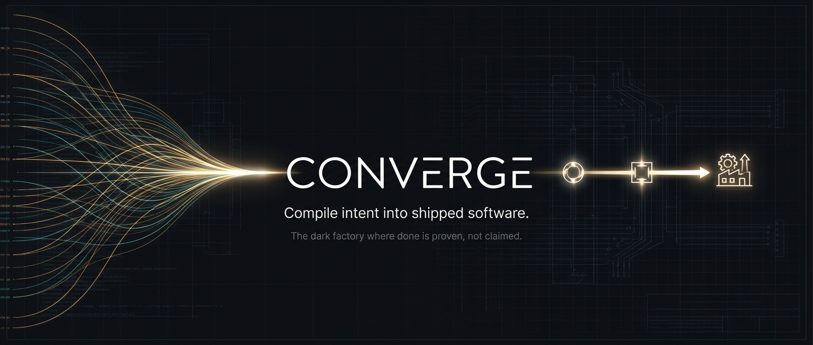
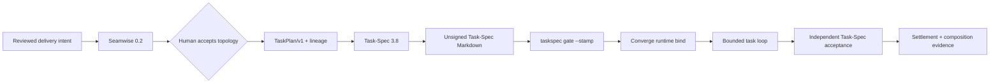

<div align="center">

[](https://github.com/luanmorenommaciel/converge)

# Converge

**Coordinate intent, decomposition, task authority, execution, and settlement without duplicating authority.**

[](https://github.com/luanmorenommaciel/converge/actions/workflows/ci.yml)
[](https://github.com/luanmorenommaciel/converge/releases)
[](#requirements)
[](LICENSE)

Converge 0.2.0 | cvg 0.2.0 | Seamwise 0.2.0 | Task-Spec 3.8.0

[Install](#install) · [First composed journey](#first-composed-journey) · [Authority model](docs/architecture.md) · [Composed flow](docs/composed-flow.md) · [CLI reference](docs/cli-reference.md)

</div>

## Release truth

This source line is Converge 0.2.0. The composed implementation, deterministic
cross-engine tests, and authenticated Codex demo are verified against the exact
published Task-Spec and Seamwise commits. The immutable distribution is the
`v0.2.0` tag; `main` may continue to move after the release.

| Claim | Current evidence |
|---|---|
| Task-Spec 3.8.0 | Published from immutable commit `0e6180cfc3009bd4ef9cf7ab050b463e10d4af91`; hosted Ubuntu/macOS release installation green |
| Seamwise 0.2.0 | Published from immutable commit `5a398169c3fefcb65eb1a47c0cb4f967dfdc0515`; exact-commit and packaged Ubuntu/macOS gates green |
| Converge 0.2.0 | Release work merged through PRs #13–#15; `v0.2.0` identifies the immutable release commit |
| Hosted CI | All eight jobs passed on exact feature SHA `1fa054546b5678838af21969816b94f8dab4ed1b` in run `32048296517`; zero-step PR-run failures were runner infrastructure, and the owner waived a redundant pre-tag run |
| Release publication | The `v0.2.0` tag workflow independently verifies Ubuntu/macOS, builds checksummed assets, and publishes the GitHub release |
| Historical Converge 0.1.0 | Published and immutable; it documents the former bundled Task-Spec architecture |

The release never retags or moves `v0.1.0`. See
[release readiness](docs/release-readiness.md) for the live gate ledger and
[release notes](docs/releases/v0.2.0.md) for migration details.

## What Converge owns

Converge is the thin coordinator and assurance layer around two independent
engines. It calls their public binaries. It does not import, vendor, or copy
their implementations.



| System | Sole authority |
|---|---|
| Seamwise | Evidence-backed seams, swimlanes, capability legs, reviewed decomposition, `TaskPlan/v1`, and lineage |
| Task-Spec | TaskPlan validation, materialization, Task-Spec structure, authorization, handoff, evals, and acceptance |
| Converge | Cross-engine sequencing, executable binding, bounded execution, settlement, and composition receipts |
| Human reviewer | Acceptance of Seamwise topology and explicit risk decisions |
| Executor | Product-code changes inside the authorized runtime contract; never self-acceptance |

Duplicate capability is tolerable. Duplicate authority is not. A Seamwise
review does not authorize task dispatch, a Task-Spec materialization receipt
does not sign a task, and model narration is never settlement evidence.

## Install

### Requirements

- Git
- Bash 3.2 or newer
- Python 3
- Task-Spec 3.8.0 for every Converge installation
- Seamwise 0.2.0 only for decomposition and `cvg compose`
- Node 22 only for the npm door and Cockpit

Install the published stack in dependency order:

```bash
git clone --branch v3.8.0 https://github.com/luanmorenommaciel/task-spec.git
bash task-spec/install.sh --global --copy
taskspec demo

python3 -m pip install   "git+https://github.com/luanmorenommaciel/seamwise.git@v0.2.0"

git clone --branch v0.2.0   https://github.com/luanmorenommaciel/converge.git
bash converge/install.sh --target /absolute/path/to/your-project --copy
```

Converge also supports:

```bash
npm install -g github:luanmorenommaciel/converge
cvg-install
```

or:

```bash
CVG_REF=v0.2.0   bash -c "$(curl -fsSL https://raw.githubusercontent.com/luanmorenommaciel/converge/main/install.sh)"
```

The installer projects exactly eleven Converge skills to `.agents/skills/`,
`.claude/skills/`, and `.grok/skills/`. It installs no Task-Spec or Seamwise
implementation. Copy mode pins the coordinator, contracts, templates, and
skills into the consumer.

## First composed journey

Start from a Git repository whose recipe is committed. Explicit binary
overrides make the exact engine candidates auditable.

```bash
export CVG_TASKSPEC_BIN=/absolute/path/to/task-spec/bin/taskspec
export CVG_SEAMWISE_BIN=/absolute/path/to/seamwise/bin/seamwise

cvg compose prepare --source recipe.yaml
# COMPOSE=NEEDS_REVIEW

cvg compose review   --reviewer "repository-owner"   --reason "The seams, ownership, dependencies, and rollback paths are accepted."
# COMPOSE=PREVIEW_READY

cvg compose preview
# COMPOSE=PREVIEW_READY

cvg compose materialize
# COMPOSE=MATERIALIZED

cvg compose status
# COMPOSE=MATERIALIZED
```

The materialized leaves still contain `signed_off: false`.
Authorization remains explicit and per leaf:

```bash
taskspec gate --stamp cvg/tasks/T-20260815-health-status.md
cvg bind --task cvg/tasks/T-20260815-health-status.md
git add cvg/tasks cvg/execution
git commit -m "authorize and bind health status task"
cvg loop --issue T-20260815-health-status --agent codex
```

A successful loop must end in `TASK_LOOP=LOCAL_SETTLED` or
`TASK_LOOP=SETTLED` and `ACCEPTED=1`. The composition receipt is stored at
`cvg/receipts/composition/composition-receipt.json`; it binds engine versions,
the immutable source commit, Seamwise review/lineage/TaskPlan digests,
Task-Spec materialization evidence, and every task hash. It always records
`dispatch_authorized: false`.

## Strict engine delegation

Converge coordinates the independent engines. It generates neither the
decomposition nor Task-Spec content. `cvg decompose` is a compatibility alias
for Seamwise preparation, and every `cvg tasks` verb delegates to Task-Spec.

```bash
cvg init
cvg setup signing
cvg lane "add a health endpoint"

cvg capture
cvg intent
cvg structure
cvg decompose --source recipe.yaml
cvg compose review --reviewer owner --reason "Topology accepted"
cvg tasks plan --manifest seamwise/task-plan.json
cvg compose materialize
cvg tasks validate cvg/tasks/T-20260815-health-status.md
cvg tasks gate --stamp cvg/tasks/T-20260815-health-status.md
cvg bind --task cvg/tasks/T-20260815-health-status.md
cvg loop --issue T-20260815-health-status --agent codex
```

The task backlog lives under `cvg/tasks/`. Converge exports
`TASKSPEC_WORKSPACE_ROOT`, `TASKSPEC_BACKLOG_DIR`, and
`TASKSPEC_ACCEPTANCE_DIR` to keep nested workspaces on the same explicit root.

## Machine contract

Every public form accepts global `--json` and `--dry-run` in any position.

```bash
cvg --json help
cvg version --json
cvg agent-context --json
cvg compose --json status
```

`--json` emits one `ConvergeCLIResult/v1` document, preserves the underlying
exit code, emits no ANSI, and reports `changed` and `dry_run`. The canonical
57-form matrix is [contracts/cli-command-matrix.json](contracts/cli-command-matrix.json);
the human reference and test coverage derive from it.

Stable compose states are:

- `COMPOSE=NEEDS_REVIEW`
- `COMPOSE=PREVIEW_READY`
- `COMPOSE=MATERIALIZED`
- `COMPOSE=BLOCKED`
- `COMPOSE=ENGINE_UNAVAILABLE`

`cvg compose status` is read-only and returns one safe next action. It blocks on
a stale review, changed plan, mismatched task set, changed task bytes,
incompatible engine, or stale receipt.

## Cockpit

[Cockpit](apps/cockpit/) is a read-only observation and interpretation surface
over `cvg snapshot`. It does not become a second source of truth and it cannot
authorize work.

```bash
npm run cockpit:install
npm run cockpit:dev --   --cvg-home "$PWD"   --project-root /absolute/path/to/project
```

Ask Converge is optional ACP interpretation. Agent prose is not a gate verdict,
receipt, or acceptance record.

## Repository map

| Path | Role |
|---|---|
| `bin/` | Stable CLI plus focused private helpers |
| `contracts/` | Canonical CLI matrix and versioned JSON Schemas |
| `skills/` | Exactly eleven Converge orchestration and assurance skills |
| `apps/cockpit/` | Read-only observer UI |
| `templates/` | Consumer workspace templates |
| `tests/` | Hermetic gate, install, loop, JSON, and composed-flow suites |
| `docs/` | Architecture, composed flow, CLI reference, release notes, and archived evidence |

## Verification

One Makefile owns the release entrypoints:

```bash
make check
make check-json
make check-docs
make check-composed
make check-live-evidence
make demo-composed
make release-check
```

`release-check` is necessary but not sufficient for publication. The tag
workflow runs the hosted Ubuntu, macOS, Cockpit, JSON, docs, package, and
composed-E2E boundaries before it publishes assets. A zero-step GitHub job is
infrastructure evidence, not a passed gate.

## Scope of v0.2.0

This release promises a reproducible composed single-task path with strict
external-engine boundaries. It does not promise Manager fleet scheduling,
production reliability, a live tracker, or autonomous approval of human
decisions.

## Documentation

- [Architecture and authority](docs/architecture.md)
- [Composed flow and failure semantics](docs/composed-flow.md)
- [CLI reference](docs/cli-reference.md)
- [Release readiness ledger](docs/release-readiness.md)
- [0.2.0 release notes](docs/releases/v0.2.0.md)
- [Documentation and archive inventory](docs/README.md)
- [Skill catalog](skills/README.md)
- [Cockpit guide](apps/cockpit/README.md)

## License

[MIT](LICENSE)
