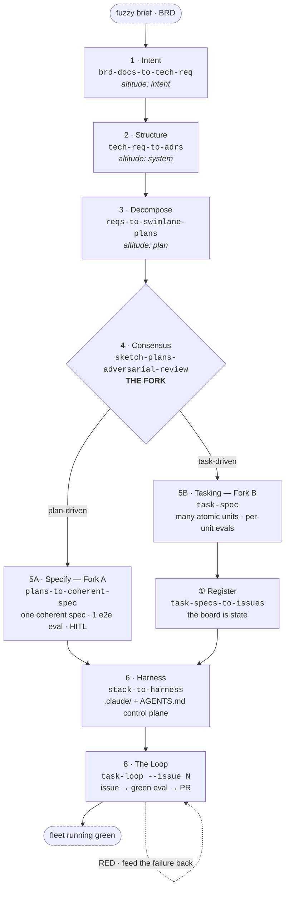

<div align="center">

# Converge

### Compile a fuzzy brief into an autonomous, eval-gated system.

A canonical, engine-agnostic **method** — eight passes, one fork, a closed loop —
shipped as **11 Claude Code skills**. You don't write the system; you **compile
intent into it**. You are converged when the eval passes, not when you feel done.

<br/>


-2da44e)


**[The Method](#-the-method--the-spine)** ·
**[Quickstart](#-quickstart)** ·
**[The Eight Passes](#-the-eight-passes)** ·
**[The Fork](#-the-fork--one-big-gate-or-many-small-ones)** ·
**[Skills Catalog](#-skills-catalog)** ·
**[The Two Moats](#-the-two-moats)**

</div>

---

Converge treats building software as a **compilation pipeline**. A requirement
arrives fuzzy, and instead of holding "done" as private judgment — refined by
taste, defended in review, never written down — you lower that requirement
through a fixed descent of passes. Each pass is more precise than the last, each
binds the right engine for its altitude, and each ends at a **gate** that must go
green before the next pass runs. When the descent bottoms out, "done" is a
machine-checkable condition an engine can satisfy unsupervised.

> [!TIP]
> **New here?** Read [`docs/cvg-aut-systems-spine-steps-v2.pdf`](docs/cvg-aut-systems-spine-steps-v2.pdf)
> — the canonical blueprint — then jump to **[Quickstart](#-quickstart)** to wire
> the skills into your own repo. This repo is the *portable method*, kept
> independent of any single use-case so it can evolve on its own.

<details>
<summary><b>Table of contents</b></summary>

- [Why Converge exists](#why-converge-exists)
- [Positioning — vs raw Claude Code & the SDD field](#positioning--vs-raw-claude-code--the-sdd-field)
- [🧭 The Method — the spine](#-the-method--the-spine)
- [🚀 Quickstart](#-quickstart)
- [🪜 The Eight Passes](#-the-eight-passes)
- [🍴 The Fork — one big gate, or many small ones?](#-the-fork--one-big-gate-or-many-small-ones)
- [🗂 Skills Catalog](#-skills-catalog)
- [🧬 Anatomy of a Task-Spec](#-anatomy-of-a-task-spec)
- [🛡 The Two Moats](#-the-two-moats)
- [👷 One method, every engineer](#-one-method-every-engineer)
- [📐 The honest boundary](#-the-honest-boundary)
- [🎬 The method, end to end on one feature](#-the-method-end-to-end-on-one-feature)
- [📁 Repository layout](#-repository-layout)
- [❓ FAQ](#-faq)
- [Provenance · Contributing · License](#provenance)

</details>

---

## Why Converge exists

The old loop ran in your head. That loop does not scale to AI engines, because an
engine cannot execute a standard it cannot read. The AI-native engineer inverts
it: take a fuzzy requirement and lower it through a repeatable descent until
"done" is a condition an engine satisfies on its own.

- **Compile intent, don't write the system.** Each pass is a transformation with a
  typed output and a gate — exactly how a compiler lowers source through
  intermediate representations down to machine code. You specify the descent and
  verify each lowering; the pipeline emits the system.
- **Build the factory from day one.** Converge refuses the retrofit. It is
  factory-shaped from Pass 1: every pass already ends in a gate, every task is
  born with a runnable eval, and the harness is a control plane from the first
  file. When you decide to step out, there is nothing to rewrite — the gates
  already hold without you.
- **The eval defines done, not you.** A loop that stops because it tried three
  times has *not* converged; a loop that stops because the eval is green has.
- **Engines are commodity slots.** Every engine and tracker is bound by a **flag,
  never a name** — `--adversary codex`, `--tracker linear`, `--issue N`,
  `--agent kimi`. Swap Claude, Codex, or Kimi freely; the gate is unmoved.
- **One method, every discipline.** The loop never inspects *what* a task is — only
  whether its eval is green. Data, software, DevOps, and AI engineering all ride
  the same spine.

---

## Positioning — vs raw Claude Code & the SDD field

The canonical 2026 spec-driven pipeline is **Specify → Plan → Tasks → Implement**,
punctuated by human checkpoints — Spec Kit, Kiro, OpenSpec, and BMAD all share
that shape. Converge is a **loop-closed superset**: it adds the three things those
frameworks lack — an adversarial **Consensus** pass, an explicit trust-boundary
**Fork**, and a closed execution **Loop** that drives a whole fleet to green.

| Capability | Raw Claude Code | SDD frameworks<br/>(SpecKit · Kiro · OpenSpec · BMAD) | **Converge** |
|---|:---:|:---:|:---:|
| Fuzzy brief → verifiable spec | manual | ✅ Specify | ✅ **Pass 1, gated** |
| Grounding against the real repo (ADRs) | ad hoc | partial | ✅ **Pass 2** |
| A *different model* attacks the plan | ❌ | ❌ | ✅ **Pass 4 · Consensus** |
| Explicit trust-boundary fork | ❌ | ❌ | ✅ **The Fork** |
| Self-verifying atomic units (eval = done) | ❌ | partial | ✅ **Task-Spec** |
| Control plane / harness built for the stack | manual | ❌ | ✅ **Pass 6 · Harness** |
| Closed loop → green-eval PR | ❌ | ❌ (stops at Implement) | ✅ **Pass 8 · The Loop** |
| Vendor-portable (Claude / Codex / Kimi) | ❌ | vendor-specific | ✅ **engines are flags** |

> The named frameworks stop at *Implement*, with a human standing at the
> checkpoint. Converge keeps going — and it doesn't replace them: SpecKit / Kiro /
> OpenSpec / BMAD are exactly the frameworks that host **Fork A** (see below).

---

## 🧭 The Method — the spine

> **Intent → Structure → Decompose → Consensus → [Fork: Specify | Tasking] → Register → Harness → Loop.**
> A fuzzy brief becomes a tech-spec, the tech-spec becomes ADRs, the ADRs become
> swimlane plans, the plans survive an adversarial review, and there the path
> forks on **where the trust boundary sits**. Both branches reconverge through the
> same Harness and Loop. Each output is the next input; the chain descends from a
> fuzzy brief to a fleet running green.



**The invariant** — *every pass lowers altitude, binds an engine, ends at a gate.*
Three guardrails make the sequence canonical, not merely descriptive: **Pass 2
writes ADRs only** (no code), **Pass 3 is plan-altitude only** (no tasks, no SQL),
and **the fork is an output of Pass 4** — never assumed earlier. **Pass 8 is the
exception: it does not lower, it *closes*.**

The **Manager** — which issue runs, when, in parallel, watching PRs, settling the
dependency graph — is a future **CI/CD** concern (e.g. GitHub Actions), *not* an
in-session skill. `task-loop` is the execution loop you build; you schedule the
Manager around it later.

---

## 🚀 Quickstart

The skills live in this repo so the method can evolve on its own. To **use** them
in a consuming repo, make them visible to Claude Code under that repo's
`.claude/skills/` — symlink (tracks upstream) or copy (pins a version):

```bash
# from your project root — symlink the whole chain (recommended)
for s in /path/to/converge/skills/*/; do
  ln -s "$s" ".claude/skills/$(basename "$s")"
done

# …or copy just the ones you need
cp -R /path/to/converge/skills/task-spec  .claude/skills/
cp -R /path/to/converge/skills/task-loop  .claude/skills/
```

Restart Claude Code, then drive the chain **one pass at a time** by its trigger
phrases:

```text
"turn this brief into a tech-spec"      → Pass 1  · brd-docs-to-tech-req
"write the ADRs / ground the spec"      → Pass 2  · tech-req-to-adrs
"decompose into swimlane plans"         → Pass 3  · reqs-to-swimlane-plans
"adversarial review — attack the plans" → Pass 4  · sketch-plans-adversarial-review
"create a task-spec"                    → Pass 5B · task-spec
"register the tasks to Linear"          → ①       · task-specs-to-issues
"scaffold the harness"                  → Pass 6  · stack-to-harness
"run issue 41"                          → Pass 8  · task-loop
```

> [!NOTE]
> Every skill passes Anthropic's official validator
> (`skills/skill-creator/scripts/quick_validate.py`) — **11 / 11**. Engines and
> trackers are always **flags**, never baked into a skill's name.

**Author + gate a single Task-Spec (the cornerstone unit), start to finish:**

```bash
# 1 · GENERATE — scaffold a spec from intent
bash .claude/skills/task-spec/scripts/generate-task-spec.sh <slug> <effort> [agent] [source]

# 2 · VALIDATE — structural linter (does NOT stamp)
bash .claude/skills/task-spec/scripts/validate-task-spec.sh tasks/T-<slug>.md

# 3 · GATE — the autonomy contract; flips signed_off:true on structural + eval pass
bash .claude/skills/task-spec/scripts/safe-to-delegate.sh --stamp tasks/T-<slug>.md
#    → VERDICT: DELEGATE   (the only path to a dispatchable spec)
```

---

## 🪜 The Eight Passes

Each pass has an **altitude**, an **engine** (bound by flag), a typed **output**,
and a machine-checkable **gate**. This is the whole method at a glance:

| # | Pass | Skill | Altitude | Engine (flag) | Out → Gate |
|:--:|------|-------|----------|---------------|------------|
| **1** | Intent | `brd-docs-to-tech-req` | intent | `--engine cowork` | tech-spec · *answers the brief* |
| **2** | Structure | `tech-req-to-adrs` | system | Claude Code on repo | `docs/adrs/*` · *terrain named, no "build X"* |
| **3** | Decompose | `reqs-to-swimlane-plans` | plan | Claude Code (same session) | `sketch/*.plan` · *plan-altitude only* |
| **4** | Consensus | `sketch-plans-adversarial-review` | plan (hardened) | `--adversary codex` | sharpened plans · *no objection survives · **fork decided*** |
| **5A** | Specify *(Fork A)* | `plans-to-coherent-spec` | coupled spec | `--framework speckit` | one spec + 1 e2e eval · *whole system is the unit of trust* |
| **5B** | Tasking *(Fork B)* | `task-spec` | atomic unit | `task-spec` engine | `tasks/T-*.md` · *every task carries a runnable eval* |
| **①** | Register | `task-specs-to-issues` | board | `--tracker linear` | 1 spec = 1 issue · *the board is state* |
| **6** | Harness | `stack-to-harness` | control layer | `agents-kbs-tech-stack` | `.claude/` + `AGENTS.md` · *control plane stands, grounded* |
| **8** | The Loop | `task-loop` | runtime | `--issue N --agent claude` | branch → green eval → PR · *the eval is green, run not read* |

<details>
<summary><b>Pass-by-pass — the steps inside each gate</b></summary>

**1 · Intent** — *the client hands you the problem; you produce the spec.*
`UNDERSTAND` read the BRD like a senior engineer → `INTERROGATE` grill the 2–3
questions whose answers most change the build → `CRYSTALLIZE` resolve into one
tech-spec. **Gate:** you can restate the client's problem in one breath and show
the spec answers it — scope, data, and success metric named, every requirement
falsifiable, metrics traced to the BRD's KPIs.

**2 · Structure** — *greenfield or brownfield — and write the ADRs.*
`NAME THE GROUND` (brownfield = a system you didn't write; name it explicitly) →
`GROUND` open the system end to end, reconcile the spec against real schemas,
sources, and jobs → `RECORD` write `docs/adrs/*.md` — facts and constraints, never
how to build. **Gate:** terrain understood and each grounding decision recorded
durably; the moment an ADR says "build X", you've drifted into planning.

**3 · Decompose** — *split the work along its natural seams.*
`SEAMS` cut where the system is already jointed (a feature or component edge) →
`ONE PLAN EACH` every seam becomes one swimlane sketch plan → `GROUNDED` each lane
inherits the relevant ADRs. **Gate:** one plan per genuine seam, each listing
features / dependencies / build-order / proving-tests, plan-altitude held (no
tasks, no SQL, no handler code); the downstream lane names the exact upstream
interface it consumes.

**4 · Consensus** — *bring a different engine to refute the plans.*
`ATTACK` a different model refutes, one plan at a time, defaulting to "refuted" →
`GROUND` check each plan against the tech-spec and ADRs for contradictions, gaps,
silent assumptions → `SHARPEN` every objection is FIXED in a plan or ACCEPTED with
a named owner. **Gate:** no open objection survives **AND** the fork is declared at
the top of every plan (Fork A whole-system / Fork B per-unit) with a reason.
*Cross-model disagreement is the point — a model won't refute itself hard enough.*

**5A · Specify (Fork A, plan-driven)** — *lift the swimlane plans into one coherent spec.*
`LIFT` the reviewed plans fold into one coupled specification → `COUPLE` the trust
boundary wraps the whole system → `BIND EVAL` one end-to-end eval defines done
(`make seed → make land → dbt run → API/MCP answers`). **Gate:** one coherent spec
exists, the whole system is its unit of trust, a single e2e eval runs against the
real flow. *A human holds one big gate, held longer.*

**5B · Tasking (Fork B, task-driven)** — *atomic · self-contained · engine-agnostic.*
`CUT` one indivisible unit per task → `DESCRIBE` name the work and paths, not the
harness → `BIND EVAL` a runnable eval defines done. **Gate:** every task carries a
runnable eval — *no eval, not a task yet.* The trust boundary wraps each unit;
verification is per-unit; you step out one gate at a time.

**① Register** — *each Task-Spec becomes one tracked issue.*
1:1 projection — one spec, one issue, `blocked-by` links carry the `depends_on`
graph. The tracker is a pluggable backend behind a two-method adapter (read ready
/ write result). **Gate:** `count(issues) == count(signed-off specs)`, every
dependency edge is one link, no orphans, no cycles. *Only the loop writes state,
only a green eval closes an issue — so the board never lies.*

**6 · Harness** — *build the rails the work rides on — the quality moat.*
`SCOPE` read which techs the in-scope tasks put in play → `SCAFFOLD` paired
architect + developer agents per tech, grounded KBs, doctrine, rules → `EMIT`
cross-tool mirrors (`AGENTS.md`, Cursor rules, Copilot instructions). **Gate:** the
control plane stands and is grounded, three universal closers are wired, the
`quality-gate` lint is green, mirrors emitted. *The stack fills the harness — the
tasks point at it.*

**8 · The Loop** — *build the execution loop; schedule the Manager later.*
`READ` one issue (`--issue N`) → its task-spec + cited ADRs + grounded harness →
`ACT` cut a branch, write code → `RUN EVAL` → **RED:** feed the failure back and
revise (tight local loop) · **GREEN:** open a PR that closes the issue. **Gate:**
the task's own eval is green — none by hand, none by attempt-count. *That
green-eval-closes-the-issue discipline is the Dark Factory, one issue at a time.*

</details>

---

## 🍴 The Fork — one big gate, or many small ones?

Pass 4 ends by deciding **one** thing: *where does the trust boundary sit?* Every
pass before it lowered altitude in a straight line. Here the line splits. Both
answers are valid Converge, and both reconverge on the **identical shared gate**
(`eval passes = merged`) — which is what makes Converge *one method with two
paths, not two methods.*

|  | **Fork A · plan-driven** | **Fork B · task-driven** |
|---|---|---|
| **framework** | `plans-to-coherent-spec` — SpecKit / Kiro / OpenSpec / BMAD | `task-spec` — per-unit |
| **coupling** | one coherent, coupled spec | many atomic, independent units |
| **trust boundary** | wraps the **whole system** | wraps **each unit** |
| **verify** | ONE end-to-end eval | per-unit runnable evals |
| **HITL posture** | one big gate, held longer | step out one gate at a time → **dark factory** |
| **use when** | pieces only make sense together | work is loosely coupled and each unit stands alone |

Either path can reach the Dark Factory — only **Fork B** gets there
*incrementally*, removing the human one gate at a time instead of all at once.

---

## 🗂 Skills Catalog

Eleven skills: **nine passes** on the spine, plus a **harness engine** and
**authoring tooling**. Every skill is self-contained (`SKILL.md` + `references/` +
`scripts/`, with `runbooks/`, `templates/`, and `tests/` on the larger ones).

| Skill | Pass | Role | Key flags (default) | Ships |
|-------|:----:|------|---------------------|-------|
| [`brd-docs-to-tech-req`](skills/brd-docs-to-tech-req) | 1 | BRD → verifiable tech-spec | `--engine cowork` · `--out-format pdf` | `check-tech-spec.sh` |
| [`tech-req-to-adrs`](skills/tech-req-to-adrs) | 2 | ground the spec, write ADRs | *(fixed: Claude Code on repo)* | `scaffold-adr.sh` |
| [`reqs-to-swimlane-plans`](skills/reqs-to-swimlane-plans) | 3 | split into swimlane plans | *(single transform)* | `new-plan.sh` |
| [`sketch-plans-adversarial-review`](skills/sketch-plans-adversarial-review) | 4 | a different model refutes; name the fork | `--adversary codex\|gemini\|gpt` | `check-consensus-gate.sh` |
| [`plans-to-coherent-spec`](skills/plans-to-coherent-spec) | 5A | fuse plans → one coupled spec + e2e eval | `--framework speckit\|kiro\|openspec\|bmad` | `scaffold-e2e-eval.sh`, `check-coherent-spec.sh` |
| [`task-spec`](skills/task-spec) | 5B | atomic, self-verifying **Task-Spec v3** units | severity-scaled eval thresholds | **22 scripts** + test suite (see below) |
| [`task-specs-to-issues`](skills/task-specs-to-issues) | ① | project tasks onto a tracker | `--tracker github\|linear\|jira` (linear) | `register.sh`, `verify-registration.sh` |
| [`stack-to-harness`](skills/stack-to-harness) | 6 | scaffold the control plane the stack needs | *(stack-derived)* | delegates to `agents-kbs-tech-stack` |
| [`task-loop`](skills/task-loop) | 8 | one issue → green-eval PR | `--issue N` (req) · `--agent claude\|codex\|kimi` | `run-issue-eval.sh`, `open-issue-pr.sh` |
| [`agents-kbs-tech-stack`](skills/agents-kbs-tech-stack) | *engine* | scaffolder that Pass 6 drives (v0.3.0) | `--strict` (quality gate) | `scaffold.sh`, `install-closers.sh`, `quality-gate.sh`, `emit-cross-tool.sh` + 6 more |
| [`skill-creator`](skills/skill-creator) | *tooling* | author, eval, and validate skills | — | `quick_validate.py`, `run_eval.py`, `run_loop.py` + eval-viewer |

**By the numbers:** 11 skills · **53** shell scripts · **11** Python scripts · **41**
reference docs · **21** runbooks · **8** test harnesses.

<details>
<summary><b>The harness engine — <code>agents-kbs-tech-stack</code> (v0.3.0)</b></summary>

For each tech the tasks put in play it scaffolds a **paired** `architect`
(planning, trade-offs, *no Bash*) + `developer` (code, tests, *has Bash*) agent and
a full KB tree. It also installs **three universal closers** — `code-reviewer`,
`code-simplifier`, `code-documenter` — that ground in every tech's KB at runtime
via the closer-hook protocol, and **emits cross-tool mirrors** so every engine
inherits one contract:

| Emitted file | For |
|---|---|
| `AGENTS.md` | Codex, OpenAI Agents SDK, taskship, anthive |
| `.cursor/rules/agents.mdc` + `.cursor/rules/<tech>.mdc` | Cursor |
| `.github/copilot-instructions.md` | GitHub Copilot |
| `.claude/` (agents, `kb/`, `doctrine.yaml`, `rules/`) | Claude Code |

A `quality-gate.sh` pass lints the scaffold for drift (BLOCKER / IMPORTANT / NIT;
`--strict` exits non-zero on any BLOCKER), and a tunable `doctrine.yaml` captures
portable defaults (Bash boundary, threshold floors, closer-hook protocol).

</details>

---

## 🧬 Anatomy of a Task-Spec

`task-spec` (Pass 5B) is the cornerstone unit — atomic, vendor-neutral, and
**self-verifying**. Each spec carries its own runnable bash success criteria, so
an agent reads it, executes, runs the evals, and loops on failure *without a human
in the middle of the loop*. This is **Eval-Driven Development (EDD)** — the same
conceptual leap as TDD or Infrastructure-as-Code.

````markdown
---
id: T-20260519-add-health-endpoint
status: ready
format_version: 3
effort: S
touches_paths: [src/api/server.py, tests/test_health.py]
depends_on: []
signed_off: false          # only the gate flips this to true
---

## Behavior
- B-1 — GIVEN the server is running WHEN a client GETs /health THEN 200 + {"status":"ok"}

## Success Criteria        # THE MOAT — runnable, deterministic
```bash
eval_1() { curl -fs localhost:8001/health | jq -e '.status == "ok"'; }
```

## Exit Check
```bash
eval_1
```
````

| Zone | Holds | Why |
|------|-------|-----|
| **Frontmatter** | id · status · effort · touches_paths · depends_on · `signed_off` | atomic, trackable, gate-controlled |
| **1 · Intent** | goal + why + bounded context | why the task exists |
| **2 · Contract** | runnable evals + validation card + exit check | **self-verifying — the moat** |
| **3 · Guardrails** | anti-patterns + do-not-touch | bound the blast radius |
| **4 · Operations** | open questions | admit the unknowns |

The **sign-off envelope** is a key-optional **HMAC-SHA256** seal: `--stamp` writes
`signed_off_sig` over a canonical payload and the validator recomputes it, so
hand-stamping is rejected — the only path to the autonomy contract is the gate.
Ships as a plugin at **v3.1.0** with a JSON Schema (Draft 2020-12), an L0/L1/L2
conformance suite, and dispatch recipes for Claude Code, Codex, Kimi, Cursor,
Gemini, taskship, and anthive. Full details:
[`skills/task-spec/README.md`](skills/task-spec/README.md).

---

## 🛡 The Two Moats

Converge holds **two** moats, not one, and the discipline is to keep them separate.

- **Task-Spec = the optionality moat.** Because the *eval* — not the agent —
  defines done, any coding agent (Claude, Codex, Kimi) is a swappable commodity
  slot. Swap the engine; the gate is unmoved.
- **Harness = the quality moat.** The control-plane files that make any commodity
  agent succeed. Not downloadable — built, tested, failed, and rebuilt over
  thousands of hours. The 2026 finding holds: one harness re-run across five
  models yielded **+2.3 to +10.1 points with no retraining**.

> **Run on commodity models; produce defensible output.**

---

## 👷 One method, every engineer

The loop never inspects what a task *is* — only whether its eval is green. All
role-specificity is pushed down into the per-task eval, so the *role does not
change the machine — it only changes the assertion the machine waits on.*

| Role | What its task's eval is |
|------|-------------------------|
| Data Engineer | a dbt test + a control-sum query against gold |
| Software Engineer | a unit / integration test that passes |
| DevOps | `terraform plan` clean + a smoke test |
| AI Engineer | a retrieval-precision or eval-set threshold met |

---

## 📐 The honest boundary

> [!IMPORTANT]
> The Loop converges to **green evals, not to correct outcomes**. A passing spec
> test guarantees only that the code matches the spec — if the spec is wrong, the
> code faithfully implements the wrong thing. The Dark Factory automates the
> *build*, not the *judgment of whether the spec was right*. The defense is
> structural and partial, not total: **Pass 1's gate** forces the spec to answer
> the brief, and **Pass 4's adversary** attacks it before any code is written.
> Stating this plainly is the point — the intellectual honesty is the moat's
> foundation, not a footnote.

---

## 🎬 The method, end to end on one feature

One feature carries the whole framework: *"daily revenue per product category,
served via MCP so a non-engineer can ask for it"* — on the real
**postgres → duckdb → dbt → MCP** repo.

| Pass | What happens on the real repo |
|------|-------------------------------|
| **1 · Intent** | BRD → tech-spec: one gold model + one MCP tool over raw orders + payments + products. *Gate: the spec answers the brief.* |
| **2 · Structure** | Brownfield. Open `src/db/01_schema.sql`; write ADRs `0001-join-on-order-id`, `0002-utc-date-grain`, `0003-revenue-is-paid-only`. |
| **3 · Decompose** | Two plans, plan-altitude only: Plan A transform (`silver → gold_daily_revenue`), Plan B serve (`mcp tool query_daily_revenue`). |
| **4 · Consensus** | `--adversary codex` attacks: *"midnight off-by-one (no TZ)? refunds counted?"* Fix: pin UTC (ADR-0002). Accept: refunds out of v1. **Fork → task-driven.** |
| **5B · Tasking** | `tasks/build_gold_revenue` (eval: dbt test + control-sum) and `tasks/build_mcp_revenue` (eval: tool result == gold query). Each born with its eval. |
| **① Register** | `--tracker linear`: `build_gold_revenue → ISSUE-41 [ready]`; `build_mcp_revenue → ISSUE-42 [blocked-by 41]`. |
| **6 · Harness** | Stack = dbt + duckdb + mcp → scaffold `.claude/` with `dbt-architect`, `mcp-developer`, KBs, `AGENTS.md`. The control plane stands. |
| **8 · The Loop** | `task-loop --issue 41`: dbt test RED (null categories) → add `COALESCE` → GREEN + control-sum matches → PR; 41 done. Unblocks 42 → PR; 42 done. |

**The Dark Factory, on this repo:** a non-engineer asks the MCP *"revenue by
category yesterday?"* — and it answers. Built brief → deploy, every step
eval-verified, the human walked out at the gate.

---

## 📁 Repository layout

```text
converge/
├── skills/                              # the Converge skill chain (11 skills)
│   ├── brd-docs-to-tech-req/            # Pass 1  · Intent
│   ├── tech-req-to-adrs/                # Pass 2  · Structure
│   ├── reqs-to-swimlane-plans/          # Pass 3  · Decompose
│   ├── sketch-plans-adversarial-review/ # Pass 4  · Consensus — THE FORK
│   ├── plans-to-coherent-spec/          # Pass 5A · Specify (Fork A)
│   ├── task-spec/                       # Pass 5B · Tasking (Fork B) — cornerstone
│   ├── task-specs-to-issues/            # ①       · Register (tracker as state)
│   ├── stack-to-harness/                # Pass 6  · Harness (quality moat)
│   ├── task-loop/                       # Pass 8  · The Loop (execution)
│   ├── agents-kbs-tech-stack/           # engine  · the scaffolder Pass 6 drives
│   └── skill-creator/                   # tooling · skill authoring + validation
└── docs/                                # canonical spine documentation (PDFs)
    ├── cvg-aut-systems-spine-steps-v1.pdf   # v1 — the 7 passes as a document
    └── cvg-aut-systems-spine-steps-v2.pdf   # v2 (current) — Pass 8, the fork, the moats, the worked example
```

| Doc | What it is |
|-----|------------|
| [`cvg-aut-systems-spine-steps-v1.pdf`](docs/cvg-aut-systems-spine-steps-v1.pdf) | v1 blueprint — the seven passes as a document |
| [`cvg-aut-systems-spine-steps-v2.pdf`](docs/cvg-aut-systems-spine-steps-v2.pdf) | **v2 (current)** — adds Pass 8 (The Loop), the fork, the two moats, and the end-to-end worked example |

---

## ❓ FAQ

<details>
<summary><b>Is Converge a library I install, or a method?</b></summary>

Both — but primarily a **method**. The eight passes are the intellectual product;
the 11 skills are the runnable embodiment for Claude Code. You adopt the method by
wiring the skills into your repo's `.claude/skills/` (see
[Quickstart](#-quickstart)) and running the chain pass by pass.
</details>

<details>
<summary><b>Do I have to run all eight passes?</b></summary>

No. It's **modular in use, factory-shaped in design** — take any single pass on its
own. But the guarantees compound: the gates only hold *without you* when every
upstream pass has already closed its own gate.
</details>

<details>
<summary><b>Fork A or Fork B — which do I pick?</b></summary>

You don't pick up front — **Pass 4 decides it** as an output. Choose **Fork A**
(one coherent spec, one big human gate) when the pieces only make sense together;
choose **Fork B** (atomic eval-backed tasks) when the work is loosely coupled and
you want to step out one gate at a time toward the Dark Factory.
</details>

<details>
<summary><b>Can I use Codex / Kimi / Gemini instead of Claude?</b></summary>

Yes — that's the optionality moat. Engines are bound by **flags**
(`--adversary codex`, `--agent kimi`), never by name. The eval defines done, so the
coding agent is a commodity slot.
</details>

<details>
<summary><b>What's the "Manager" and why isn't it a skill?</b></summary>

The Manager decides *which* issue runs, when, in parallel, and watches PRs — that's
an orchestration layer, and a Git-native world already provides most of it (GitHub
Actions as scheduler, the PR as state settlement, branch protection as the gate).
So Converge builds the execution **Loop** now and schedules the Manager around it
later in CI/CD, rather than hand-rolling an in-session orchestrator.
</details>

---

## Provenance

Extracted from the `uc-postgres-duckdb-dbt-analytics` repo, where Converge was
first run end-to-end on a real **postgres → duckdb → dbt → MCP** use-case. That
worked example (its BRD, tech-spec, plans, tasks, and scaffolded harness) stays in
the source repo; **this** repo holds only the portable method.

## Contributing

Skills are self-contained and follow Anthropic's skill conventions — validate any
change with `python3 skills/skill-creator/scripts/quick_validate.py <skill-dir>`.
Add concepts under a skill's `references/concepts/`, operational playbooks under
`runbooks/`, and keep engines/trackers behind flags, never names.

## License

MIT. Built by Luan Moreno. Use freely; attribute when citing.

<div align="center">
<br/>
<i>"You are converged when the eval passes — not when you feel done."</i>
</div>
