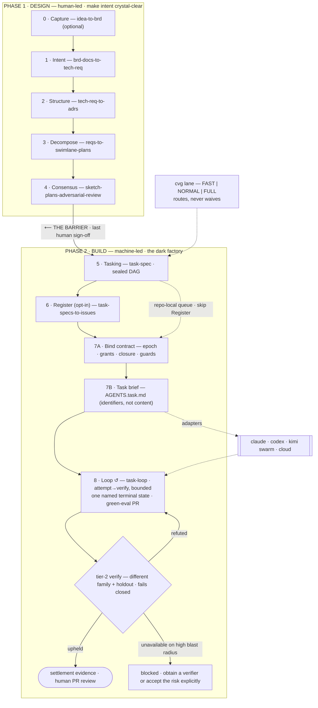

<div align="center">

# Converge

### Compile a fuzzy brief into an autonomous, eval-gated system.

A canonical, engine-agnostic **method** — **two phases, one barrier, a closed
loop** — shipped as **12 Claude Code skills**. You are converged when the eval
passes, not when you feel done.

<br/>


-2da44e)


**[The Method](#-the-method--two-phases-one-barrier)** ·
**[Quickstart](#-quickstart)** ·
**[Why not SpecKit / Kiro?](#-why-not-spec-kit--kiro--openspec--bmad)** ·
**[The Nine Passes](#-the-nine-passes)** ·
**[The Barrier](#-the-barrier--where-the-human-hands-off)** ·
**[Skills](#-skills-catalog)**

**Works with** · Claude Code (native skills) · Codex (`AGENTS.md`) · Kimi ·
Cursor (`.cursor/rules`) · Copilot (instructions) — engines are **flags, never names**

</div>

---

Converge treats building software as a **compilation pipeline**. A requirement
arrives fuzzy, and instead of holding "done" as private judgment, you lower it
through a fixed descent of passes — each more precise than the last, each ending
at a **gate** that must go green before the next runs. Halfway down there is a
**barrier**: the last human sign-off. Above it, humans make intent crystal-clear;
below it, the machine builds — specs in, green-eval PRs out.

This is **intent-driven development**: invest the human effort where models stay
weak — *getting the intent right and verifying the result* — and get out of the
way where they're strong — *implementation*. As more is automated, sending the
right intent stays the one irreducible driver of building the right thing.

> [!TIP]
> **New here?** Read [`docs/converge-method-v6.pdf`](docs/converge-method-v6.pdf)
> — the canonical blueprint — and [`skills/README.md`](skills/README.md) for the
> skill-by-skill map. This repo is the *portable method*, kept independent of any
> single use-case so it can evolve on its own.

<details>
<summary><b>Table of contents</b></summary>

- [🧭 The Method — two phases, one barrier](#-the-method--two-phases-one-barrier)
- [🚀 Quickstart](#-quickstart)
- [Why Converge exists](#why-converge-exists)
- [🥊 Why not Spec Kit / Kiro / OpenSpec / BMAD?](#-why-not-spec-kit--kiro--openspec--bmad)
- [🪜 The Nine Passes](#-the-nine-passes)
- [🚧 The Barrier — where the human hands off](#-the-barrier--where-the-human-hands-off)
- [🗂 Skills Catalog](#-skills-catalog)
- [🧬 Anatomy of a Task-Spec](#-anatomy-of-a-task-spec)
- [🛡 The Two Contracts](#-the-two-contracts)
- [👷 One method, every engineer](#-one-method-every-engineer)
- [📐 The honest boundary](#-the-honest-boundary)
- [🎬 The method, end to end on one feature](#-the-method-end-to-end-on-one-feature)
- [📁 Repository layout](#-repository-layout)
- [🧾 Status](#-status)
- [❓ FAQ](#-faq)
- [Provenance · Contributing · License](#provenance)

</details>

---

## 🧭 The Method — two phases, one barrier

> **PHASE 1 · DESIGN (human-led):** Capture → Intent → Structure → Decompose → **Consensus**.
> **PHASE 2 · BUILD (machine-led):** Tasking → Register → Bind → Loop.
> The barrier sits at **Consensus** — the last human sign-off. A fuzzy brief
> becomes a tech-spec, the tech-spec becomes ADRs, the ADRs become swimlane
> plans, the plans survive an adversarial review, the human signs off — and from
> there the machine cuts tasks, binds a runtime, and drives the fleet to green.



**The invariant** — *every pass lowers altitude, binds an engine (by flag), ends
at a gate.* Three guardrails make the sequence canonical: **Pass 2 writes ADRs
only** (no code), **Pass 3 is plan-altitude only** (no tasks, no SQL), and **the
barrier is an output of Pass 4** — never assumed earlier. **Pass 8 is the
exception: it does not lower, it *closes*.**

---

## 🚀 Quickstart

The skills live in this repo so the method can evolve on its own. To **use** them
in your project, run the installer from that project:

```bash
git clone https://github.com/luanmorenommaciel/converge.git ~/converge

cd ~/my-project
bash ~/converge/install.sh
```

That does two separate things: it makes the eleven skills visible to Claude Code
under `.claude/skills/`, and it puts the `cvg` CLI on your PATH. It verifies
itself and prints `INSTALL=OK`. Re-running it is safe.

Symlinks are the default, so `git pull` in the checkout updates every project at
once. Pin a version instead when a repo must build the same way in six months:

```bash
bash ~/converge/install.sh --copy          # pins this version
bash ~/converge/install.sh --no-bin        # skills only, leave my PATH alone
bash ~/converge/install.sh --help          # all the flags
```

**Verify the wiring:**

```bash
cvg version
# → cvg 0.1.0 (task-spec 0.1.0)

python3 .claude/skills/skill-creator/scripts/quick_validate.py .claude/skills/task-spec
# → Skill is valid!
```

…then restart Claude Code and drive the descent one pass at a time by its trigger
phrases:

```text
"capture this idea into a brief"        → Pass 0 · idea-to-brd
"turn this brief into a tech-spec"      → Pass 1 · brd-docs-to-tech-req
"write the ADRs / ground the spec"      → Pass 2 · tech-req-to-adrs
"decompose into swimlane plans"         → Pass 3 · reqs-to-swimlane-plans
"adversarial review — attack the plans" → Pass 4 · sketch-plans-adversarial-review
"create a task-spec"                    → Pass 5 · task-spec
"register the tasks to Linear"          → Pass 6 · task-specs-to-issues
"bind this task for execution"          → Pass 7 · task-to-runtime-contract
"run issue 41"                          → Pass 8 · task-loop
```

**Where your work lives — the `cvg/` workspace.** Converge keeps everything it
produces under one root, so each kind of knowledge has one home and one
lifecycle:

```text
cvg/
├── brain/        your raw inputs — append-only, never gated, feed it constantly
├── docs/         consensus artifacts — brd-*, tech-spec-*, adrs/, CONTEXT.md, lessons/
├── sketch/       swimlane plans — transient by design, superseded at Pass 5
├── tasks/        sealed execution units — HMAC-stamped T-*.md
├── execution/    per-task runtime contracts + task briefs (Pass 7)
└── receipts/     evidence — gate verdicts and pass receipts, write-once
```

*brain feeds → docs agree → sketch explores → tasks execute → receipts prove.*

Every pass discovers this workspace first and the bare directory second
(`cvg/tasks/` then `tasks/`), and an explicit path or `--tasks-dir` always wins.
The workspace **need not be the git root** — `<repo>/projects/demo/cvg/` works —
and everything resolves relative to it, including the directory a spec's own
evals run in. You do not have to create this by hand: the passes write into it,
and `cvg setup harness` scaffolds the project router that points a worker at it.

**Author + gate a single Task-Spec (the cornerstone unit), start to finish:**

```bash
# 0 · KEY (once per repo) — provision the HMAC signing key so the gate can seal
#     specs for Tier-1 crypto trust (unsupervised dispatch). Skip it and the gate
#     still runs, but only reaches Tier-2 (structural) → supervised dispatch only.
bash .claude/skills/task-spec/configs/setup-taskspec-signing-key.sh

# 1 · GENERATE — scaffold a spec from intent (fill the {{TODO}} stubs it leaves)
bash .claude/skills/task-spec/scripts/generate-task-spec.sh <slug> <effort> [agent] [source]

# 2 · VALIDATE — structural linter (warns on unfilled stubs; does NOT stamp)
bash .claude/skills/task-spec/scripts/validate-task-spec.sh cvg/tasks/T-<slug>.md

# 3 · GATE — the autonomy contract; flips signed_off:true on structural + eval pass,
#     then seals the eval bodies in an HMAC envelope so hand-stamping is rejected
bash .claude/skills/task-spec/scripts/safe-to-delegate.sh --stamp cvg/tasks/T-<slug>.md
#    → VERDICT: DELEGATE   (the only path to a dispatchable spec)
```

---

## Why Converge exists

The old loop ran in your head. That loop does not scale to AI engines, because an
engine cannot execute a standard it cannot read. The AI-native engineer inverts
it: take a fuzzy requirement and lower it through a repeatable descent until
"done" is a condition an engine satisfies on its own.

- **Compile intent, don't write the system.** Each pass is a transformation with a
  typed output and a gate — exactly how a compiler lowers source through
  intermediate representations to machine code. You specify the descent and verify
  each lowering; the pipeline emits the system.
- **Reduce blockers, not the gate.** The machine is free to reason about *how*;
  what it is never free to skip is the eval. Procedural handholding shrinks as
  models improve — the isolated verifier does not. It is the load-bearing property.
- **The eval defines done, not you.** A loop that stops because it tried three
  times has *not* converged; a loop that stops because the eval is green has.
- **Engines are commodity slots.** Every engine and tracker is bound by a **flag,
  never a name** — `--adversary codex`, `--tracker linear`, `--issue N`,
  `--agent kimi`. Swap Claude, Codex, or Kimi freely; the gate is unmoved.
- **One method, every discipline.** The loop never inspects *what* a task is — only
  whether its eval is green. Data, software, DevOps, and AI engineering all ride
  the same spine.

---

## 🥊 Why not Spec Kit / Kiro / OpenSpec / BMAD?

The canonical 2026 spec-driven pipeline is **Specify → Plan → Tasks → Implement**,
punctuated by human checkpoints — Spec Kit, Kiro, OpenSpec, and BMAD share that
shape. Converge is a **loop-closed superset** that starts *earlier* and ends
*later*: it owns the full front-of-funnel (a raw idea becomes a sealed spec) and
it keeps going past *Implement* to a fleet running green.

| Capability | Raw Claude Code | SDD frameworks<br/>(SpecKit · Kiro · OpenSpec · BMAD) | **Converge** |
|---|:---:|:---:|:---:|
| Raw idea → verifiable spec (front of funnel) | manual | starts at *Specify* | ✅ **Passes 0–1, gated** |
| Grounding against the real repo (ADRs) | ad hoc | partial | ✅ **Pass 2** |
| A *different-family model* attacks the plan | ❌ | ❌ | ✅ **Pass 4 · Consensus** |
| An explicit human/machine barrier | ❌ | implicit checkpoints | ✅ **The Barrier** |
| Self-verifying atomic units (eval = done) | ❌ | partial | ✅ **Task-Spec** |
| HMAC-sealed spec as the only instruction source | ❌ | ❌ | ✅ **injection defense** |
| Task-specific runtime contract + multi-engine harness | manual | ❌ | ✅ **Pass 7 · Bind** |
| Authority that **closes** (no lingering session permissions) | ❌ session-scoped | ❌ | ✅ **capability envelope** |
| Honest *prevent vs detect* per runtime, failing closed | ❌ | ❌ | ✅ **resolver manifest** |
| Graded by a model that **didn't write the code**, against a **holdout** | ❌ | ❌ | ✅ **`cvg verify`** |
| Routes small work around the ceremony **without waiving a gate** | ❌ | ❌ | ✅ **`cvg lane`** |
| Closed loop → green-eval PR | ❌ | ❌ (stops at Implement) | ✅ **Pass 8 · The Loop** |
| Vendor-portable (Claude / Codex / Kimi / cloud) | ❌ | vendor-specific | ✅ **engines are flags** |

> **Where this sits in the field.** Dan Shapiro's *Five Levels: from Spicy
> Autocomplete to the Dark Factory* (Jan 2026) tops out at **L5 — the dark
> factory** (specs in, software out, no human reading the diff). Converge's
> **Phase 1 is the L4 work** (write and argue the spec, craft the skills); **Phase
> 2 is L5**. The field's litmus test for a *real* dark factory is three
> load-bearing properties — **written specs**, an **isolated evaluator grading
> against holdout the coder can't see**, and an **unchanged deploy path**. Converge
> now ships all three: the holdout verifier is `cvg verify`, where a
> *different-family* engine grades the diff against the spec's intent and criteria
> the implementer never saw, and fails closed. The honest caveat is that this is a
> model judging (assurance, not proof), which is why it is a **secondary** check
> behind a deterministic eval and never reported as one. What keeps it durable as the pattern gets crowded: the full
> front-of-funnel intent descent, cross-*family* consensus, HMAC-sealed specs,
> multi-harness portability, and derived-not-stored state.

---

## 🪜 The Nine Passes

Each pass has an **altitude**, an **engine** (bound by flag), a typed **output**,
and a machine-checkable **gate**. Passes 0–4 are human-led; 5–8 are machine-led.

| # | Pass | Skill | Altitude | Out → Gate |
|:--:|------|-------|----------|------------|
| **0** | Capture *(optional)* | `idea-to-brd` | idea | BRD · `CHECK_BRD` |
| **1** | Intent | `brd-docs-to-tech-req` | intent | tech-spec · `CHECK_TECH_SPEC` |
| **2** | Structure | `tech-req-to-adrs` | system | `cvg/docs/adrs/*` + `CONTEXT.md` · `CHECK_ADR` |
| **3** | Decompose | `reqs-to-swimlane-plans` | plan | `cvg/sketch/swimlane-*/` · `CHECK_PLAN` |
| **4** | **Consensus — THE BARRIER** | `sketch-plans-adversarial-review` | plan (hardened) | sharpened plans + objection log · `CHECK_CONSENSUS` · **last human sign-off** |
| **5** | Tasking | `task-spec` | atomic unit | `cvg/tasks/T-*.md` · `TIER=1` for unattended execution (HMAC-sealed) |
| **6** | Register *(opt-in)* | `task-specs-to-issues` | board | 1 spec = 1 issue · `CHECK_REGISTER` |
| **7** | Bind *(7A contract + 7B brief)* | `task-to-runtime-contract` | runtime contract | profile + guards + task brief · `CHECK_RUNTIME_CONTRACT` |
| **8** | The Loop *(+ tier-2 verify)* | `task-loop` | runtime | `cvg loop` → `TASK_LOOP=<state>`; `cvg verify` → `CHECK_VERIFY=<verdict>` |

**Pass ownership versus code placement.** `task-loop` is the primary Pass 8
skill. The separate `cvg verify` command is also a Pass 8 runtime surface, but
its implementation lives in `task-to-runtime-contract` because it reads the
bound spec, diff, and held-out criteria. That placement does not turn it into
another pass or renumber Bind.

The **Manager** — which issue runs, when, in parallel, watching PRs, settling the
dependency graph — is a future **CI/CD** concern (e.g. GitHub Actions), *not* an
in-session skill. `task-loop` is the execution loop you build; you schedule the
Manager around it later ([`PLAN.md`](PLAN.md) tracks it as B-1, the P0 item).

<details>
<summary><b>Pass-by-pass — the steps inside each gate</b></summary>

**0 · Capture** *(optional on-ramp)* — no client brief? Grill the stakeholder's
questions in frontier rounds, draft the BRD in the owner's voice, stop at the
brief. **Gate:** the pain carries a provenance-tagged number, a KPI is in the
owner's terms, scope in/out non-empty, every open question owned.

**1 · Intent** — *the client hands you the problem; you produce the spec.*
`UNDERSTAND` → `INTERROGATE` the 2–3 questions that most change the build →
`CRYSTALLIZE` into one tech-spec. **Gate:** you can restate the problem in one
breath and show the spec answers it — every requirement falsifiable.

**2 · Structure** — *greenfield or brownfield — and write the ADRs.* Ground the
spec against real schemas, sources, and jobs; record each grounding decision as
`docs/adrs/*.md`. **Gate:** terrain understood; the moment an ADR says "build X",
you've drifted into planning.

**3 · Decompose** — *split the work along its natural seams* (seam → swimlane →
leg). One plan per genuine seam, plan-altitude only. **Gate:** each lane lists
features / dependencies / build-order / proving-tests; the downstream lane names
the exact upstream interface it consumes.

**4 · Consensus — the barrier** — *bring a different-family engine to refute the
plans.* Every objection is FIXED or ACCEPTED with a named owner, stamped in a
provenance-hashed objection log. **Gate:** no open objection survives **and the
owner signs off** — the hand-off from human design to machine build.

**5 · Tasking** — *atomic · self-contained · engine-agnostic.* One indivisible
unit per task; a runnable eval defines done; the PRE-gate HMAC-seals the spec so
it becomes the only trusted instruction source. **Gate:** every task carries a
runnable eval — *no eval, not a task yet.*

**6 · Register** *(opt-in)* — *each Task-Spec becomes one tracked issue* (or stays
repo-local). 1:1 projection; `blocked-by` carries `depends_on`. **Gate:**
`count(issues) == count(signed-off specs)`, every edge one link, no orphans, no
cycles — a real parity gate that can fail.

**7 · Bind** — *bind one signed task to the runtime, and emit the harness.* Hash
the spec to the smallest evidence slice, pick a topology, enforce path guards, and
emit the task brief the worker reads (7B). **Gate:**
`CHECK_RUNTIME_CONTRACT=PASS`.

**8 · The Loop** — *build the execution loop; schedule the Manager later.* Read one
issue → signed spec + bound evidence → cut a branch → **attempt → verify →
repeat**, each attempt a fresh engine process briefed from disk, bounded on
iterations · wall-clock · tokens with a stagnation detector, until **GREEN:** path
guard, then one PR. Every run lands in exactly one **named terminal state**
(`SETTLED`, `LOCAL_SETTLED`, `NO_OP`, `BLOCKED`, `STALLED`, `EXHAUSTED`,
`CANCELLED`, `ERROR`) — an error or an exhausted budget is never reported as
success, and exhaustion is a *planned* landing with a handoff note. **Gate:** the
task's own eval and the runtime path policy are green — *green-eval-closes-the-issue
is the dark factory, one issue at a time.*

</details>

---

## 🚧 The Barrier — where the human hands off

Pass 4 ends by doing **one** thing: the owner signs off. Every pass before it is
human-led — you are making intent crystal-clear. Every pass after it is
machine-led — the sealed spec is the only instruction, the eval is the only judge
of done. That single line is the whole shape of the method:

|  | **Above the barrier** (0–4) | **Below the barrier** (5–8) |
|---|---|---|
| **who** | human-led design | machine-led build |
| **the work** | make intent crystal-clear | turn intent into green-eval PRs |
| **the artifact** | BRD → spec → ADRs → plans → sign-off | sealed task-specs → issues → contracts → merged PRs |
| **the human's job** | own the intent + the verification | walk out at the gate |

*Why put it at Consensus and not earlier?* Because that's the first moment the
plan has survived a *different model* trying to break it. Signing off before that
is signing off on an unexamined plan; the machine would then faithfully build a
flaw. The adversary is what makes the sign-off worth something.

---

## 🗂 Skills Catalog

Eleven skills: **nine that implement the spine** plus **two utilities**
(`skill-creator`, `pass-to-lesson`). Every skill is self-contained
(`SKILL.md` + `references/` + `scripts/`, with `runbooks/`, `templates/`, and
`tests/` on the larger ones).

> 📖 **Deep dive:** [`skills/README.md`](skills/README.md) — the full
> skill-by-skill guide.

| Skill | Pass | Role | Key flags (default) |
|-------|:----:|------|---------------------|
| [`idea-to-brd`](skills/idea-to-brd) | 0 | raw idea → BRD *(optional on-ramp)* | `--out-format md\|pdf` |
| [`brd-docs-to-tech-req`](skills/brd-docs-to-tech-req) | 1 | BRD → verifiable tech-spec | `--engine cowork` · `--out-format pdf` |
| [`tech-req-to-adrs`](skills/tech-req-to-adrs) | 2 | ground the spec, write ADRs | *(fixed: Claude Code on repo)* |
| [`reqs-to-swimlane-plans`](skills/reqs-to-swimlane-plans) | 3 | split into swimlane plans | *(single transform)* |
| [`sketch-plans-adversarial-review`](skills/sketch-plans-adversarial-review) | 4 | a different-family model refutes · **the barrier** | `--adversary codex\|kimi\|claude` |
| [`task-spec`](skills/task-spec) | 5 | atomic, self-verifying **Task-Spec** units · **cornerstone** | severity-scaled eval thresholds |
| [`task-specs-to-issues`](skills/task-specs-to-issues) | 6 | project tasks onto a tracker *(opt-in)* | `--tracker github\|linear\|jira` (linear) |
| [`task-to-runtime-contract`](skills/task-to-runtime-contract) | 7 | bind a signed task + emit the multi-engine harness | `--topology single` |
| [`task-loop`](skills/task-loop) | 8 | one issue → green-eval PR | `--issue N` (req) · `--agent claude\|codex\|kimi` |
| [`pass-to-lesson`](skills/pass-to-lesson) | *util* | after any pass, teach what was built | `--depth full\|brief` |
| [`skill-creator`](skills/skill-creator) | *util* | author, eval, and validate skills | — |

**By the numbers:** 11 skill packages (9 spine + 2 utility) with full
regression and conformance suites in `task-spec` and `task-to-runtime-contract`.

---

## 🧬 Anatomy of a Task-Spec

`task-spec` (Pass 5) is the cornerstone unit — atomic, vendor-neutral, and
**self-verifying**. Each spec carries its own runnable bash success criteria, so
an agent reads it, executes, runs the evals, and loops on failure *without a human
in the middle of the loop*. This is **Eval-Driven Development (EDD)** — the same
conceptual leap as TDD or Infrastructure-as-Code.

````markdown
---
id: T-20260519-add-health-endpoint
status: ready
format_version: 3
effort: S
touches_paths: [src/api/server.py, tests/test_health.py]
depends_on: []
signed_off: false          # only the PRE-gate flips this to true
accepted: false            # only the POST-gate flips this to true
---

## Behavior
- B-1 — GIVEN the server is running WHEN a client GETs /health THEN 200 + {"status":"ok"}

## Success Criteria        # THE MOAT — runnable, deterministic
```bash
eval_1() { curl -fs localhost:8001/health | jq -e '.status == "ok"'; }
```

## Exit Check
```bash
eval_1
```
````

The **two gates are duals** — same evals, opposite expectations.
`safe-to-delegate.sh --stamp` (PRE) certifies the *spec*: evals are well-formed
bash, assertion failure expected, and an **HMAC-SHA256 envelope** seals the eval
bodies so hand-stamping is rejected. `accept-task.sh --stamp` (POST) certifies the
*work*: evals re-run from a clean checkout, the change set stayed inside the blast
radius, the HMAC is intact — with an optional `--gold-sanity` Goodhart guard that
blocks evals that also pass on the unpatched baseline. An **effort gate** routes
work by size (XS–M → Task-Spec; L conditional on a long-horizon engine; XL and
subjective work refused).

Ships inside Converge at the package version, with the spec **FORMAT at v3** — a data
contract versioned independently of the release, as are `VALIDATOR_VERSION` and the
HMAC envelope. Carries a JSON Schema (Draft 2020-12), an L0/L1/L2
executor-conformance suite, and dispatch recipes for Claude Code, Codex, Kimi,
Cursor, Gemini, taskship, and anthive. Deep-dive PDF:
[`docs/task-spec-v3.6.0.pdf`](docs/task-spec-v3.6.0.pdf).

---

## 🛡 The Two Contracts

Converge holds two contracts, and the discipline is to keep them separate.

- **Task-Spec = authorization and done.** Because the *eval* — not the agent —
  defines done, any coding agent (Claude, Codex, Kimi) is a swappable commodity
  slot. Swap the engine; the gate is unmoved.
- **Runtime contract = authority in motion.** It binds the exact signed task
  revision to the evidence, topology, permissions, and concrete guards the
  selected runtime must honor. It is task-scoped, hash-bound, and rechecked — and
  it emits the task brief (7B) and the adapters the loop runs inside.

> **Run on commodity models; produce defensible output.**

---

## 👷 One method, every engineer

The loop never inspects what a task *is* — only whether its eval is green. All
role-specificity is pushed down into the per-task eval, so the *role does not
change the machine — it only changes the assertion the machine waits on.*

| Role | What its task's eval is |
|------|-------------------------|
| Data Engineer | a dbt test + a control-sum query against gold |
| Software Engineer | a unit / integration test that passes |
| DevOps | `terraform plan` clean + a smoke test |
| AI Engineer | a retrieval-precision or eval-set threshold met |

---

## 🧭 Three things stated plainly

**Converge does not remove complexity — it relocates it into spec and eval
authoring.** That relocation is the bet: it is cheaper to argue with a spec than
to debug a regenerated flaw, because a gap in the specification resurfaces every
time the code is regenerated.

**The loop converges to green evals, not correct outcomes.** If the spec is wrong,
the machine faithfully builds the wrong thing. The defense is structural and
partial: Pass 1 forces the spec to answer the brief, Pass 4 has a *different model*
attack it, and tier-2 verification grades against a holdout the implementer never
saw. Narrower, not closed.

**Not every change deserves nine passes.** `cvg lane` routes work to the ceremony
it earns — and can never waive a gate, only choose which passes run.

---

## 📐 The honest boundary

> [!IMPORTANT]
> The Loop converges to **green evals, not to correct outcomes**. A passing spec
> test guarantees only that the code matches the spec — if the spec is wrong, the
> code faithfully implements the wrong thing. The Dark Factory automates the
> *build*, not the *judgment of whether the spec was right*. The defense is
> structural and partial, not total: **Phase 1** exists entirely to make the
> intent right, **Pass 1's gate** forces the spec to answer the brief, and **Pass
> 4's adversary** attacks it before any code is written. Stating this plainly is
> the point — the intellectual honesty is the moat's foundation, not a footnote.

---

## 🎬 The method, end to end on one feature

One feature carries the whole framework: *"daily revenue per product category,
served via MCP so a non-engineer can ask for it"* — on a real
**postgres → duckdb → dbt → MCP** repo.

| Pass | What happens on the real repo |
|------|-------------------------------|
| **1 · Intent** | BRD → tech-spec: one gold model + one MCP tool over raw orders + payments + products. *Gate: the spec answers the brief.* |
| **2 · Structure** | Brownfield. Open `src/db/01_schema.sql`; write ADRs `0001-join-on-order-id`, `0002-utc-date-grain`, `0003-revenue-is-paid-only`. |
| **3 · Decompose** | Two plans, plan-altitude only: transform (`silver → gold_daily_revenue`) and serve (`mcp tool query_daily_revenue`). |
| **4 · Consensus** | `--adversary codex` attacks: *"midnight off-by-one (no TZ)? refunds counted?"* Fix: pin UTC (ADR-0002). Accept: refunds out of v1. **Owner signs off — barrier crossed.** |
| **5 · Tasking** | `build_gold_revenue` (eval: dbt test + control-sum) and `build_mcp_revenue` (eval: tool result == gold query). Each born with its eval, HMAC-sealed. |
| **6 · Register** | `--tracker linear`: `build_gold_revenue → ISSUE-41 [ready]`; `build_mcp_revenue → ISSUE-42 [blocked-by 41]`. |
| **7 · Bind** | `cvg bind --task build_gold_revenue.md`: bind the signed hash to ADRs + cached dbt docs + single-agent topology + path guards; emit the task brief → `CHECK_RUNTIME_CONTRACT=PASS`. |
| **8 · The Loop** | `cvg loop --issue 41`: contract PASS → dbt test RED (null categories) → attempt 2 adds `COALESCE` → GREEN + path policy PASS → `TASK_LOOP=SETTLED`, one PR; 41 done, 42 unblocks. Had it failed the same way three times running, it would have landed `STALLED` with a handoff instead of burning the remaining twelve attempts. |

**The Dark Factory, on this repo:** a non-engineer asks the MCP *"revenue by
category yesterday?"* — and it answers. Built brief → deploy, every step
eval-verified, the human walked out at the barrier.

---

## 📁 Repository layout

```text
converge/
├── bin/                                 # the cvg CLI (referee: frames, dispatches, gates)
│   ├── cvg                              #   the router · zero model credentials
│   ├── _ui.sh                           #   degradation-correct ANSI layer
│   └── README.md                        #   the surface ledger
├── skills/                              # the method — 9 spine + 2 utility
│   ├── idea-to-brd/                     # Pass 0 · Capture (optional)
│   ├── brd-docs-to-tech-req/            # Pass 1 · Intent
│   ├── tech-req-to-adrs/                # Pass 2 · Structure
│   ├── reqs-to-swimlane-plans/          # Pass 3 · Decompose
│   ├── sketch-plans-adversarial-review/ # Pass 4 · Consensus — THE BARRIER
│   ├── task-spec/                       # Pass 5 · Tasking — cornerstone
│   ├── task-specs-to-issues/            # Pass 6 · Register (opt-in; tracker as state)
│   ├── task-to-runtime-contract/        # Pass 7 · Bind (+ multi-engine harness)
│   ├── task-loop/                       # Pass 8 · The Loop (execution)
│   ├── pass-to-lesson/                  # util · teach after any pass
│   └── skill-creator/                   # util · author + validate skills
├── docs/                                # the two canonical PDFs
│   ├── converge-method-v6.pdf           #   the blueprint — method, architecture, agent protocol
│   ├── task-spec-v3.6.0.pdf             #   the cornerstone unit, in depth
│   ├── src/                             #   HTML sources + render.sh (Chrome → PDF)
│   ├── presentation/                    #   interactive HTML walkthroughs
│   └── archive/                         #   superseded blueprints + proposals
├── tests/                               # the hermetic suites + two fixtures
│   ├── test-loop-kernel.sh              #   Pass 8's brakes, proven with stub engines only
│   ├── test-cvg-json-envelope.sh        #   the agent-facing output contract
│   ├── test-install.sh                  #   the install surface
│   ├── e2e-test-engine/                 #   the machine floor (incl. a designed-RED eval)
│   └── uc-analytics/                    #   the method proving ground (a real cvg/ workspace)
├── .github/workflows/ci.yml             # the gauntlet, in public — offline, no secrets, macOS + Linux
├── install.sh                           # skills → .claude/skills/ · cvg → PATH
└── PLAN.md                              # the one working document (state · rules · backlog · log)
```

| Doc | What it is |
|-----|------------|
| [`docs/converge-method-v6.pdf`](docs/converge-method-v6.pdf) | **the canonical blueprint** — the descent, the barrier, the architecture, the agent protocol, the worked example |
| [`docs/task-spec-v3.6.0.pdf`](docs/task-spec-v3.6.0.pdf) | the cornerstone unit, in depth — six tiers, dual gates, six zones, anti-reward-hacking, conformance |
| [`docs/src/`](docs/src/) | the HTML sources both PDFs render from (`render.sh`) |
| [`docs/archive/`](docs/archive/) | superseded blueprints, kept for provenance |
| [`PLAN.md`](PLAN.md) | the single working document — where we are, what's next, the rules, both tracks, the backlog, the log |

---

## 🧾 Status

**Converge 0.1.0** — the CLI, the eleven skills and the task-spec engine ship as
ONE unit at ONE version (root `VERSION`, gated by `tests/test-version-unity.sh`) ·
Anthropic validator passing on all 11 skills · extracted from a production
**postgres → duckdb → dbt → MCP** run.

**The descent 0→8 is closed on a real use case, and the backlog is empty**
(`tests/uc-analytics`, a greenfield analytical backbone over an operational
Postgres): `CHECK_BRD=PASS · CHECK_TECH_SPEC=PASS · CHECK_ADR=OK · CHECK_PLAN=OK ·
CHECK_CONSENSUS=OK · TIER=1 ×9 · CHECK_REGISTER=OK` (live board, 9⇄9, ready
frontier empty) `· CHECK_RUNTIME_CONTRACT=PASS ×9 · DOCTOR_RUNTIME_CONTRACT=OK ·
TASK_LOOP=LOCAL_SETTLED ×2 + SETTLED ×7`.

**Pass 8 is a real loop, not a gate.** The kernel enforces the budgets specs had
always declared — three-axis ceilings, a stagnation detector, a fresh process per
attempt, durable checkpoints, and eight named terminal states — proven by its own
hermetic suite (stub engines, no model called) and then driven to green across the
**entire** 9-task backlog: two settled locally, seven through merged PRs (#2–#8),
the last four green on the first iteration, each closing its own tracker issue
unattended.

**What is NOT true yet, stated plainly.** Tier-2 verification — an independent
different-family judge grading against a holdout the worker cannot see — is
implemented (`cvg verify`) and **graded none of those nine landings**: every green
above is tier-1, self-reported. No spec yet carries a `## Holdout` block. And the
**Manager** (unattended sequencing across the fleet) does not exist, so the loop
runs one task at a time, invoked by hand. Those two are the gap between a good
single-task harness and a factory — see [`PLAN.md`](PLAN.md) §2.

---

## ❓ FAQ

<details>
<summary><b>Is Converge a library I install, or a method?</b></summary>

Both — but primarily a **method**. The nine passes are the intellectual product;
the skill chain is the runnable embodiment for agent runtimes. You adopt the
method by wiring the skills into your repo's `.claude/skills/` (see
[Quickstart](#-quickstart)) and running the chain pass by pass.
</details>

<details>
<summary><b>Do I have to run all the passes?</b></summary>

No. It's **modular in use, factory-shaped in design** — take any single pass on
its own. But the guarantees compound: the gates only hold *without you* when every
upstream pass has already closed its own gate. Capture (0) and Register (6) are
explicitly optional.
</details>

<details>
<summary><b>Do I have to register onto a tracker?</b></summary>

No — **Register (Pass 6) is opt-in.** Run it when you want a shared, visible board
with the frontier, assignees, and parallel dispatch; skip it to keep the queue
repo-local in `cvg/tasks/`. The Loop can read either.
</details>

<details>
<summary><b>Can I use Codex / Kimi / Gemini / a cloud runner instead of Claude?</b></summary>

Yes — that's the point of Pass 7. Bind emits a multi-engine harness (AGENTS.md +
adapters), so the *same* sealed task runs on `claude -p`, `codex exec`, a Kimi
swarm, or a cloud workflow. Engines are bound by **flags**, never by name; the
eval defines done, so the coding agent is a commodity slot.
</details>

<details>
<summary><b>What's the "Manager" and why isn't it a skill?</b></summary>

The Manager decides *which* issue runs, when, in parallel, and watches PRs — that's
an orchestration layer, and a Git-native world already provides most of it (GitHub
Actions as scheduler, the PR as state settlement, branch protection as the gate).
So Converge builds the execution **Loop** now and schedules the Manager around it
later in CI/CD — it's **B-1, the P0 item** in [`PLAN.md`](PLAN.md).
</details>

---

## Provenance

Extracted from the `uc-postgres-duckdb-dbt-analytics` repo, where Converge was
first run end-to-end on a real **postgres → duckdb → dbt → MCP** use-case. That
worked example (its BRD, tech-spec, plans, tasks, and scaffolded harness) stays in
the source repo; **this** repo holds only the portable method.

## Contributing

Skills are self-contained and follow Anthropic's skill conventions — validate any
change with `python3 skills/skill-creator/scripts/quick_validate.py <skill-dir>`.
Add concepts under a skill's `references/concepts/`, operational playbooks under
`runbooks/`, and keep engines/trackers behind flags, never names.

## License

MIT. Built by Luan Moreno. Use freely; attribute when citing.

<div align="center">
<br/>
<i>"You are converged when the eval passes — not when you feel done."</i>
</div>
