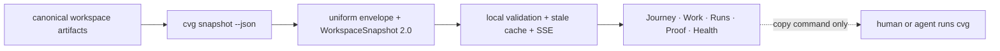

# Converge Cockpit

Cockpit is a read-only operational projection of a real Converge workspace. It
turns the nine-pass descent, canonical gate results, work queue, execution
runs, adversarial review, receipts, health, and CLI authorization into one
full-screen surface. The CLI and repository remain the source of truth.

Cockpit v1 observes the full lifecycle while execution stays in `cvg`. The UI
can copy the next authorized command, but it cannot create, run, approve,
register, bind, transition, or settle work.

## Run against a workspace

From the Converge repository root:

```bash
npm run cockpit:install
npm run cockpit:dev -- \
  --cvg-home "$PWD" \
  --project-root /absolute/path/to/your/converge-workspace
```

Open <http://127.0.0.1:4173>. Both roots are mandatory. The bridge only binds
to loopback and invokes exactly one read-only CLI command:
`cvg snapshot --json`.

For the analytics-engineering proving ground used during V0:

```bash
npm run cockpit:dev -- \
  --cvg-home "$PWD" \
  --project-root ../cvg-use-cases-e2e/use-cases/uc-01-analytics-engineering
```

If the first bridge request is unavailable, the client clearly labels and
renders the deterministic replay fixture in
[`src/data/fallback.ts`](src/data/fallback.ts). A replay is never labeled live.
After a live snapshot has loaded, a transient refresh failure retains that
last-good snapshot and marks the transport stale.

## Production build

```bash
npm run cockpit:build
npm run cockpit:start -- \
  --cvg-home "$PWD" \
  --project-root /absolute/path/to/your/converge-workspace
```

The built interface is then served with its read-only API at
<http://127.0.0.1:4174>.

## Truth path



The JSON contract is
[`../../contracts/ui/v2/workspace-snapshot.schema.json`](../../contracts/ui/v2/workspace-snapshot.schema.json).

The bridge is transport and security only. It does not run gates independently,
read Git state, scan domain files, parse CLI prose, infer associations, or
construct authorization. Those semantics are emitted by the CLI. The bridge
validates the v2 contract, serves snapshot- and SHA-bound artifact previews, and
streams semantic snapshot changes.

The interface intentionally keeps these facts separate:

- a deterministic gate verdict;
- an adversarial review verdict and its blocking questions;
- the CLI conductor's current authorization;
- whether an artifact still matches the snapshot digest.

Artifact previews require the snapshot ID and captured SHA-256. The bridge
returns `409` if the snapshot or bytes changed before the preview opened.
Files outside the evidence allowlist, symlinks escaping the workspace, binary
content, oversized previews, and common credential forms are blocked or
redacted.

## API

All API routes are `GET`-only:

| Route | Purpose |
|---|---|
| `/api/health` | Local bridge identity and read-only mode |
| `/api/snapshot` | `{ snapshot, transport }` with current or marked-stale last-good truth |
| `/api/events` | Semantic snapshot updates over server-sent events |
| `/api/artifact` | Snapshot-bound preview of allowlisted evidence |

## Verify

```bash
npm run cockpit:check
npm run cockpit:build
npm --prefix apps/cockpit run test:browser
```

`check` runs TypeScript, bridge/contract tests, and Vitest. The browser suite
runs Playwright and axe at 1600×900, 1280×720, 1024×768, 768×900, and 390×844,
and verifies read-only network traffic, responsive navigation, keyboard
interactions, and overflow constraints.

Visual principles and tokens live in [`DESIGN.md`](DESIGN.md).
The proving-ground release gates and their current evidence are recorded in
[`PROVING-GROUNDS.md`](PROVING-GROUNDS.md).

The previous `control-room:*` root scripts remain compatibility aliases for
one release. New documentation and automation must use `cockpit:*`.
