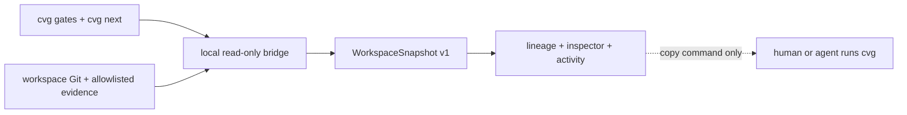

# Converge Control Room

The Control Room is a read-only visual projection of a real Converge
workspace. It turns the nine-pass descent, canonical gate results, adversarial
review, CLI authorization, evidence, and activity into one lineage surface.
The CLI and repository remain the source of truth.

This is V0: observation is implemented; execution stays in `cvg`. The UI can
copy the next authorized command, but it cannot run, approve, register, bind,
or settle work.

## Run against a workspace

From the Converge repository root:

```bash
npm run control-room:install
npm run control-room:dev -- \
  --cvg-home "$PWD" \
  --project-root /absolute/path/to/your/converge-workspace
```

Open <http://127.0.0.1:4173>. Both roots are mandatory. The bridge only binds
to loopback and only invokes a fixed allowlist of read-only CLI and Git
commands.

For the analytics-engineering proving ground used during V0:

```bash
npm run control-room:dev -- \
  --cvg-home "$PWD" \
  --project-root ../cvg-use-cases-e2e/use-cases/uc-01-analytics-engineering
```

If the bridge is unavailable, the client clearly labels and renders the
deterministic replay fixture in
[`src/data/fallback.ts`](src/data/fallback.ts). A replay is never labeled live.

## Production build

```bash
npm run control-room:build
npm run control-room:start -- \
  --cvg-home "$PWD" \
  --project-root /absolute/path/to/your/converge-workspace
```

The built interface is then served with its read-only API at
<http://127.0.0.1:4174>.

## Truth path



The JSON contract is
[`../../contracts/ui/v1/workspace-snapshot.schema.json`](../../contracts/ui/v1/workspace-snapshot.schema.json).

The interface intentionally keeps these facts separate:

- a deterministic gate verdict;
- an adversarial review verdict and its blocking questions;
- the CLI conductor's current authorization;
- whether an artifact still matches the snapshot digest.

Artifact previews require the snapshot ID and captured SHA-256. The bridge
returns `409` if the snapshot or bytes changed before the preview opened.
Files outside the evidence allowlist, symlinks escaping the workspace, binary
content, oversized previews, and common credential forms are blocked or
redacted.

## API

All API routes are `GET`-only:

| Route | Purpose |
|---|---|
| `/api/health` | Local bridge identity and read-only mode |
| `/api/snapshot` | Current `WorkspaceSnapshot` |
| `/api/events` | Snapshot updates over server-sent events |
| `/api/artifact` | Snapshot-bound preview of allowlisted evidence |

## Verify

```bash
npm run control-room:check
npm run control-room:build
```

`check` runs the TypeScript compiler and the Node bridge tests. Browser QA
should cover desktop lineage, the small-screen pass navigator, consensus
inspection, artifact focus/escape behavior, and reduced motion.

Visual principles and tokens live in [`DESIGN.md`](DESIGN.md).
