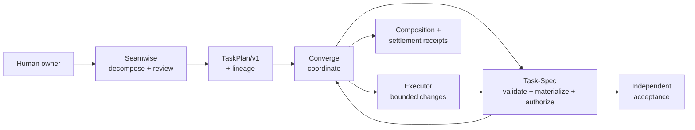
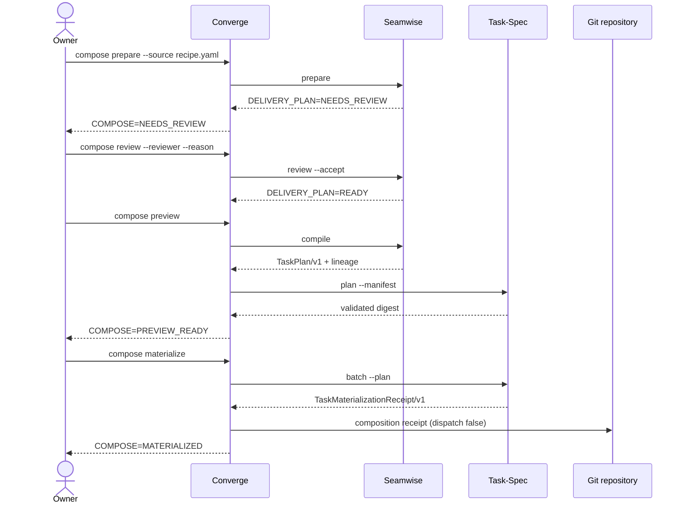

# Converge composed architecture

Status: canonical for Converge 0.2.0.

## Architectural invariant

Converge coordinates independently versioned engines over executable and JSON
boundaries. It never imports or vendors Seamwise or Task-Spec. Each decision
has one authority, and each boundary artifact is digest-bound before the next
authority may act.

## Authority table

| Decision or artifact | Sole authority | Explicit non-authority |
|---|---|---|
| Evidence-backed seams, swimlanes, legs | Seamwise | Converge does not reinterpret topology |
| Human acceptance of delivery topology | Named reviewer through Seamwise | Neither engine self-approves |
| `TaskPlan/v1` projection and lineage | Seamwise | Seamwise does not create Task-Spec Markdown |
| TaskPlan validation and task materialization | Task-Spec | Converge does not render or validate Task-Spec internals |
| Task dispatch authorization | Task-Spec `gate --stamp` | Materialization and Seamwise review both record false |
| Runtime contract and path policy | Converge | A Task-Spec cannot widen the repository fence |
| Product-code mutation | Authorized executor | Coordinator and observer do not write product code |
| Evals, handoff, acceptance | Task-Spec | Executor narration is not evidence |
| Cross-engine sequence and composition receipt | Converge | Receipt does not authorize dispatch |
| Workspace observation | Cockpit | Observer cannot mutate canonical state |

## Binary boundaries

Converge resolves engines with these explicit overrides:

- `CVG_TASKSPEC_BIN`: required for the core task lifecycle and the compose
  preview, materialize, and materialized-status phases.
- `CVG_SEAMWISE_BIN`: required for `cvg decompose` and every `cvg compose` phase.

Engine discovery and capability negotiation are lazy. A Seamwise-only prepare
or review does not require Task-Spec to be installed; Converge resolves
Task-Spec only when the workflow reaches its authority boundary.

Composition first asks Seamwise for `SeamwiseCapabilities/v1` and verifies:

- the supported engine major;
- `SeamwiseCLIResult/v1`;
- `TaskPlan/v1`;
- `SeamwiseTaskPlanLineage/v1`;
- `materializes_tasks: false`;
- `dispatch_authority: false`.

It separately asks Task-Spec for `TaskSpecCLIResult/v1` and requires a version
from 3.8.0 inclusive to 4.0.0 exclusive. A missing executable, malformed JSON,
exit-code mismatch, incompatible contract, or version change during a command
returns `COMPOSE=ENGINE_UNAVAILABLE` and changes no canonical task state.

## Artifact flow

Seamwise compilation is transactional: the only boundary outputs are
`seamwise/task-plan.json` and `seamwise/task-plan-lineage.json`. Task-Spec
materialization writes leaves under the configured Converge backlog. Converge
then writes:

- `cvg/receipts/composition/source.json`;
- `cvg/receipts/composition/taskspec-materialization-receipt.json`;
- `cvg/receipts/composition/composition-receipt.json`.

The final receipt binds all three versions, the committed recipe bytes and Git
commit, Seamwise review and lineage file hashes, the TaskPlan digest,
Task-Spec materialization receipt hash, and every materialized task hash.

## Settlement and observation

After explicit Task-Spec authorization, Converge binds a task-scoped execution
profile. The loop mints an attempt-bound handoff, runs a bounded executor,
checks the repository path policy, executes declared evals, and asks Task-Spec
for independent acceptance before settlement. A successful run provides both:

- `TASK_LOOP=LOCAL_SETTLED` or `TASK_LOOP=SETTLED`;
- `ACCEPTED=1`.

Cockpit reads `WorkspaceSnapshot 3.0`. It may explain evidence, but cannot
approve a review, stamp a task, alter a receipt, or change settlement state.
Manager fleet scheduling remains outside the v0.2.0 release scope.

<!-- pagebreak -->

## Security and failure posture

- All receipt and task paths must resolve inside the project root.
- Symlinked composition paths are refused.
- The source recipe must be tracked and byte-identical to its Git commit before materialization.
- Existing task bytes must match exactly on rerun; conflicts fail closed.
- Composition status re-hashes the complete chain and blocks stale evidence.
- Materialization interruption is recoverable because Task-Spec reruns are idempotent and the Converge receipt is written last.
- `dispatch_authorized` is always false in materialization and composition receipts.

The versioned schemas under [`contracts/`](../contracts/) are the machine
contracts. This document explains ownership; it does not replace them.
