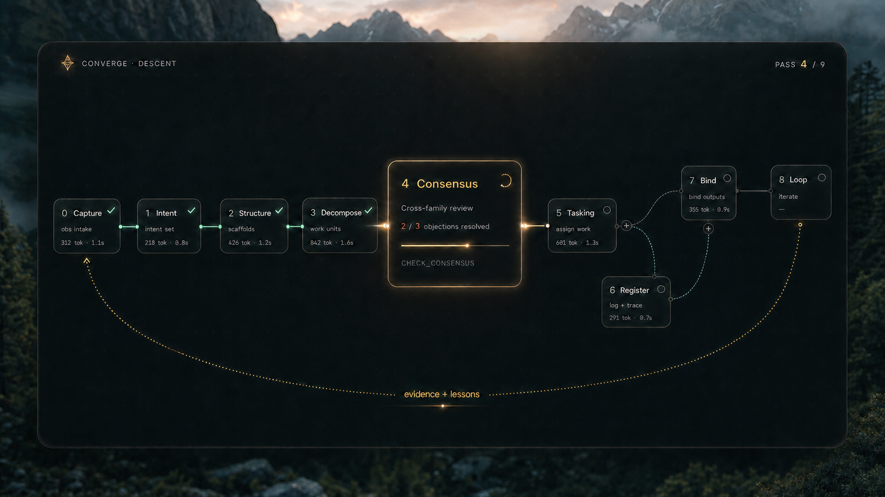
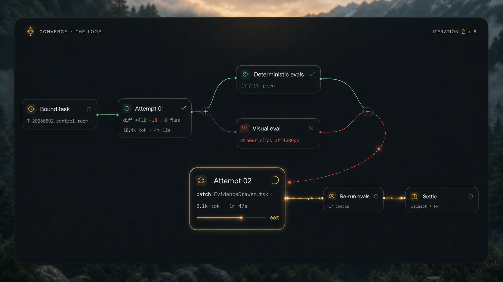
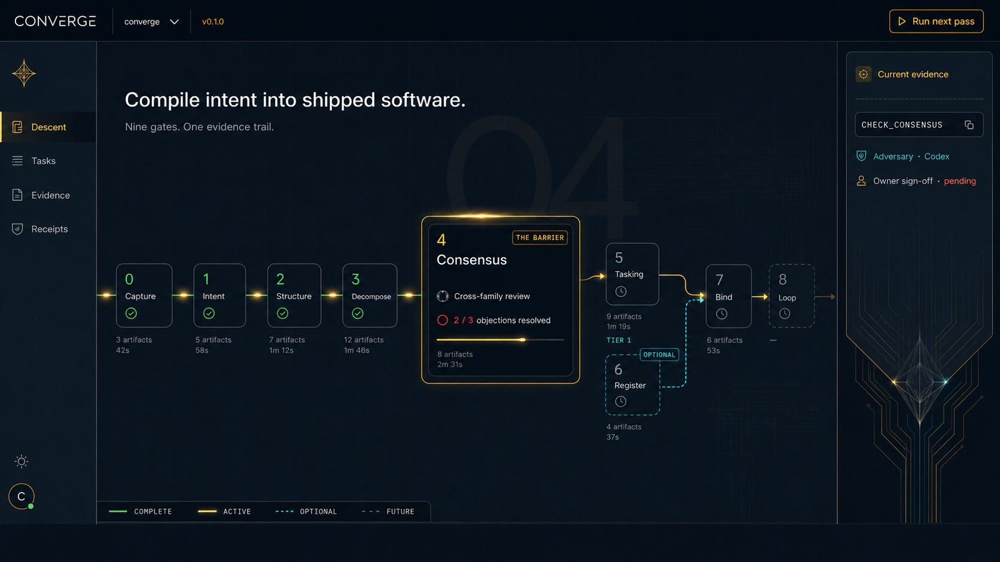
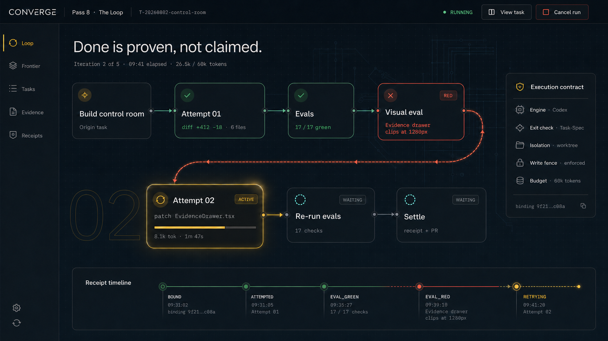

# Converge control-room concepts

Concept date: 2026-08-02  
Repository baseline: `feat/e2e` at `b585ca792418924182e1c6a87f660a5f8afa07bd` (`v0.1.0`)

These images explore a visual control plane inspired by the motion grammar in
[Brooklyn's node-workflow video](https://x.com/imbabybrooklyn/status/2083458624202944694/video/1).
They are product-direction mockups, not evidence that the frontend or every
shown control is implemented.

## Preferred V2 direction: cinematic lineage

This is the recommended visual direction. It removes conventional dashboard
chrome and lets the lineage itself become the product surface.

### Descent lineage

The floating canvas shows the completed path, active barrier, future passes,
optional Register branch, and the evidence-and-lessons return lineage.

### Loop lineage

The task lineage makes a RED visual eval and its retry path understandable at a
glance. The expanded Attempt 02 node becomes the cinematic focus.

## What the reference gets right

- The active node expands to show the current operation while inactive nodes
  stay compact.
- Edges communicate direction, progress, success, and retry rather than acting
  as static decoration.
- Evidence stays attached to work: files, duration, tokens, checks, and verdicts
  are visible at the point where they matter.
- A failed check has an explicit return path. The loop is understandable without
  reading a log.
- The canvas is visually quiet enough that state changes become the animation.

## Earlier dashboard exploration

### 1. Descent

The method-level view: Passes 0 through 8, the Pass 4 barrier, optional Register
branch, current evidence, and the exact next action.

### 2. Loop Control Room

The task-level view: a bounded Pass 8 attempt, deterministic and visual evals,
the red retry edge, execution contract, budget, and receipt timeline.

## V2 motion choreography

The V2 design depends on state-driven motion, not decorative animation:

- **Canvas arrival:** 500 ms opacity and `0.985 → 1` scale transition. The
  landscape moves at most 4 px for quiet depth.
- **Node activation:** the active node expands over roughly 320 ms with a
  critically damped spring. Detailed evidence fades in 90 ms after the shell
  starts moving.
- **Edge flow:** completed mint edges carry one restrained particle every
  2.2 seconds. The active gold edge uses a brighter 1.4-second pulse. Waiting
  edges do not animate.
- **Verdict change:** the border and status icon transition in 180 ms. RED gets
  one subtle 2 px recoil, never a repeated shake.
- **Retry:** the coral path draws from verdict to next attempt over roughly
  420 ms. The destination node begins expanding after the path reaches about
  65%, creating the handoff effect visible in the reference.
- **Progress:** bars move only from canonical progress events and use linear
  interpolation; they never simulate progress during silence.
- **Viewport:** the camera gently fits the active lineage over 300–450 ms while
  preserving the user's zoom after manual interaction.
- **Reduced motion:** remove parallax, traveling particles, path drawing, and
  scale morphs. Preserve the same meaning through labels, icons, border color,
  and immediate layout changes.

## Product boundary

The UI should be a projection and controller over Converge, not a second source
of truth.

- Canonical state remains in repository artifacts, receipts, checkpoints, and
  `cvg` verdict tokens.
- The UI must never infer success from animation, color, or a process exit alone.
- Read-only exploration is the default. Mutating actions must show their exact
  command, authority, write scope, and dry-run result before execution.
- The current release is single-task at Pass 8. A fleet/Manager view must remain
  visually and behaviorally out of scope until that runtime exists.

## What is required to build it

### 1. A structured UI contract

`cvg agent-context --json` already exposes commands, mutation flags, verdict
tokens, exit-code semantics, and global contracts. The frontend still needs
structured runtime projections rather than prose embedded in `data.output`:

- `cvg status --json`: pass nodes, canonical edges, status, evidence path, gate
  token, and next action.
- `cvg loop events --jsonl --follow`: attempt, eval, retry, budget, cancellation,
  and terminal-state events.
- `cvg receipts --json`: receipt chain and artifact links.
- Stable IDs and schema versions for every node and event.

These can be added as CLI surfaces or produced by a thin adapter, but the
contract must be tested before animation work starts.

### 2. An optional local controller

Keep the zero-dependency Bash core intact. Put the UI in an optional package,
for example `apps/control-room/`, with a small local service that:

- spawns `cvg` with argument arrays, never shell-concatenated strings;
- sets `CVG_HOME` and `CVG_PROJECT_ROOT` explicitly;
- streams JSON events to the browser with SSE;
- watches only declared Converge state folders;
- sends cancellation through the supported process signal;
- never reads or returns credentials.

### 3. The visual system

- React + TypeScript application shell.
- `@xyflow/react` for custom nodes, handles, pan/zoom, viewport control, and
  custom animated SVG edges.
- Motion for node expansion, layout transitions, presence, progress, and
  reduced-motion behavior.
- Deterministic layouts for the nine-pass descent and task loop. Auto-layout is
  useful for arbitrary task DAGs later, but the two primary views should be
  deliberately choreographed.
- Design tokens based on the existing Converge world: ink, graphite, warm gold
  for active state, cyan/green for proven state, coral for RED, and off-white
  text. Color must never carry meaning alone.

### 4. Interaction anatomy

Each workflow node needs the same typed anatomy:

- identity and pass/task number;
- state label and icon;
- current operation;
- progress;
- evidence summary;
- duration and token budget;
- gate/verdict token;
- expandable artifact and receipt links.

The canvas needs focus-active-node, fit-to-run, keyboard traversal, zoom limits,
filters, a quiet activity timeline, and a reduced-motion mode.

### 5. Verification

- Contract tests for every CLI-to-UI state mapping.
- Fixture replays for SETTLED, LOCAL_SETTLED, NO_OP, BLOCKED, STALLED,
  EXHAUSTED, CANCELLED, and ERROR.
- Component and screenshot tests at five representative viewports.
- Keyboard, screen-reader, contrast, and reduced-motion checks.
- Performance tests with large task DAG fixtures.
- A rule that the UI cannot display green unless the canonical token and receipt
  support it.

## Suggested delivery slices

1. **Visual prototype:** static fixture data, both canvases, polished motion.
2. **Read-only MVP:** live workspace status, task state, evidence, and receipts.
3. **Controlled execution:** exact-command previews, dry runs, start/cancel, and
   guarded mutations.
4. **Hardening:** accessibility, replay tests, large-graph performance, and
   optional desktop packaging.

Indicative effort for one strong product-minded frontend/full-stack engineer:
about one week for the polished interactive prototype, two to three weeks for a
read-only MVP, and three to five weeks for a trustworthy controlled MVP.

## Image-generation prompt set

- **V2 Descent lineage:** one cinematic floating canvas over a softly blurred
  alpine environment; exact Pass 0–8 lineage; expanded Pass 4 barrier; organic
  Bézier edges; luminous completed and active paths; optional Register branch;
  evidence-and-lessons return arc; no dashboard chrome.
- **V2 Loop lineage:** the same cinematic world; Bound task → Attempt 01 →
  deterministic and visual evals; RED verdict junction → coral retry curve →
  expanded active Attempt 02 → re-run → settle; no embedded cross-family judge.
- **Descent:** premium dark Converge desktop UI; exact Pass 0–8 order; expanded
  Pass 4 barrier; optional Register path after Tasking; current-evidence
  inspector; ink/gold/cyan blueprint palette; codeable node workflow; no generic
  SaaS cards or purple AI glow.
- **Loop Control Room:** premium Pass 8 execution UI; Attempt 01, green evals,
  RED visual eval, explicit retry into active Attempt 02, re-run and settlement;
  execution contract and receipt timeline; restrained ink/gold/green/coral
  palette; no cross-family verifier embedded in the loop.

Both images were generated with the built-in image-generation path, then
reviewed and corrected for Converge's current pass and verification boundaries.
