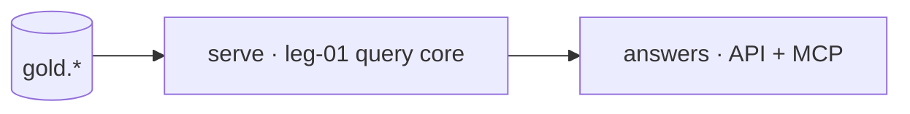

# Plan · serve lane

lane-meta: thread=no · risk=low · owner=analytics

Component **B · Serve** from the decomposition. Input contract: `gold.*`. Output contract: `answers` (the serving surface).

Plan altitude: legs, responsibilities, dependencies, build order, tests.

## Architecture



Step-by-step:

1. gold.* published tables feed the query core.
2. leg-01 exposes contract-only readers.
3. transports frame the same rows for API + MCP.

## Legs

- **leg-01** — query core: one read-only function per published gold table. Proves: each function reads only `gold.*`.
- **leg-02** — transports: API + MCP framing over the shared core. Proves: both transports return identical rows for the same question.

## The interface this lane consumes (the seam — hard boundary)

This lane reads **only the `gold.*` contract**, and never reaches below it.

| upstream unit | fields consumed | read by (this lane's leg) |
|---|---|---|
| `gold.daily_revenue` | day, category, revenue | leg-01 query core |

**Seam evolution:** additive changes (a new column) are non-breaking; renames,
removals, and newly-required fields are breaking and need a coexistence window.
The transform lane keeps a consumer-driven contract test green for these fields.

## Dependencies

```
gold.*  ->  leg-01  ->  leg-02
```

- One inbound seam: `gold.*` (owned by the transform lane).

## Build order

1. **leg-01** — the core both transports share.
2. **leg-02** — transports bind to the frozen core.

Gating edge: the frozen `gold.*` contract gates leg-01.

## Tests that prove each leg

| Leg | Tests (what they prove) |
|---|---|
| **leg-01** | Contract-only reads. Proves: the seam is never crossed downward. |
| **leg-02** | Transport parity. Proves: framing never changes the answer. |

## Open questions

| # | Item | Owner | Blocks build? |
|---|---|---|---|
| Q1 | Rate limiting on the MCP transport? | owner | No |

## Spec traceability

- **ADR-0003** — revenue-is-paid-only: the core never re-derives revenue, it reads the published field.
