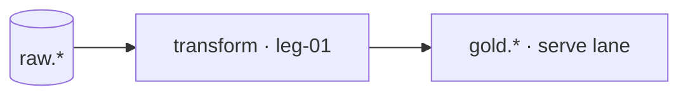

# Plan · transform lane

lane-meta: thread=yes · risk=med · owner=analytics

Component **A · Transform** from the decomposition. Input contract: `raw.*`. Output contract: `gold.*` (the seam the serve lane consumes).

Plan altitude: legs, responsibilities, dependencies, build order, tests.

## Architecture



Step-by-step:

1. raw.* landed records feed leg-01.
2. conform → model → publish shapes gold.*.
3. serve consumes gold.* only, never below the seam.

## Legs

- **leg-01** — ingest and pin the raw sources read-only. Proves: raw tables reachable, row counts stable.
- **leg-02** — conform to silver: dedup by business signature, pin types and UTC grain. Proves: no duplicate signatures, all timestamps UTC.
- **leg-03** — publish gold: serving-ready tables shaped to the frozen questions. Proves: every frozen question maps to a gold table.

## Dependencies

```
raw.*  ->  leg-01  ->  leg-02  ->  leg-03  ->  gold.*
```

- One inbound seam: `raw.*` (given, frozen).

## Build order

1. **leg-01** — unblocks everything: no raw access, no lane.
2. **leg-02** — needs leg-01's pinned sources.
3. **leg-03** — needs leg-02's conformed silver.

Gating edge: the frozen acceptance-question set gates leg-03.

## Tests that prove each leg

| Leg | Tests (what they prove) |
|---|---|
| **leg-01** | Raw reachable + stable counts. Proves: the lane reads reality, not memory. |
| **leg-02** | Signature uniqueness + UTC grain. Proves: conform is lossless and deterministic. |
| **leg-03** | Question-to-table mapping complete. Proves: the contract answers what was asked. |

## Open questions

| # | Item | Owner | Blocks build? |
|---|---|---|---|
| Q1 | Refund handling in gold? ADRs silent. | owner | No — out of v1 |

## Spec traceability

- **ADR-0002** — UTC grain honored in leg-02.
- **ADR-0003** — revenue-is-paid-only honored in leg-03.
