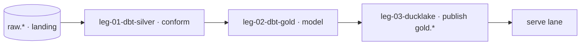

<!-- lane: swimlane-transform · sha256:6065d4830589 · assembled from 8 source(s) -->
# Terrain pack — swimlane-transform

> Derived from the passes that already settled these questions. **Not an instruction source and not an authority**: the sealed Task-Spec says what must become true, the execution contract says where you may write. This exists so you do not spend the attempt rediscovering what Passes 2-4 wrote down. Regenerate with `cvg bind`.

## Seam

Where this lane cuts: **above the landing contract, below the published contract.**
`raw.*` is consumed from capture; `gold.*` is published for serve. One-way; transform
never reaches back into `public.*` or the source (that is capture's job).

## Seam contract · dedup, revenue grain, and `gold.*` published (sharpened — Pass 4)

**Consuming `raw.*` — deterministic dedup.** Silver keeps the **max-`_lsn`** event
per business key (capture's contract guarantees LSN uniqueness → deterministic
winner); a max-`_lsn` `_op=delete` tombstone removes the key from silver. A replayed
`(key, _lsn)` is already present and is a no-op. dbt runs **incremental on the
`_lsn` high-watermark**; a full-refresh is deterministic from `raw.*` (same inputs →
same silver/gold), so a refresh is safe and idempotent. **Deletes under incremental:**
a max-`_lsn` `_op=delete` retracts the key from silver *and* the gold models
recompute the affected aggregate partition (keys touched since the last watermark),
so a deleted key never lingers in an incrementally-built gold — the deterministic
full-refresh is the reconciliation backstop, not the delete path.

**Revenue-join grain — no fan-out.** Base revenue = captured (ADR 0004), pinned at
**order grain**. Payments are **pre-aggregated to `order_id` BEFORE** the join
(1 order : N payments → SUM to order) so the payment join cannot fan out revenue;
orders → customers on `customer_id` (N:1, safe); order lines → products on
`(order_id, product_id)`. Metrics above order grain aggregate from this non-fanned
base. Keys are named here so the transitive join cannot silently double-count.
*(Decision — order-grain base; VP may repin to order-line grain.)*

**Freeze authority — one, not two.** Q-SET-1 (the frozen question set) is owned and
frozen by **analytics-eng**; the `gold.*` schema is *derived from* Q-SET-1 to answer
it and frozen **with** it — one freeze event, propagated. Serve gates on the
`gold.*` contract, which is downstream of that single freeze — not a second
authority.

**Published `gold.*` — freshness watermark + atomic publish.** Each `gold.*` table
carries a **freshness watermark** `gold_as_of` = min over contributing source
domains of max(`_source_committed_at`) ingested — i.e. "gold reflects every source
commit up to `gold_as_of`"; the min-over-domains lets one lagging domain honestly
lower the watermark. Publish is an **atomic DuckLake snapshot swap** (leg-03): a run
writes a new snapshot and flips the pointer, so a reader sees the whole old or whole
new snapshot, never a torn mix.

## Non-Goals (from the lane plan)

- No capture — the feed is capture's job (transform reads only `raw.*`).
- No serving surface — that is the serve lane.
- No net-of-refunds revenue in v1 base (ADR 0004 pins base revenue = captured).

## Architecture (from the lane plan)

Step-by-step:

1. dbt conforms `raw.*` to silver (dedup, types, UTC grain) on DuckDB.
2. dbt models the gold metrics (revenue = captured, transitive joins) against the ADRs.
3. gold is published as DuckLake tables shaped to the frozen Q-SET-1; `gold.*` hands off to serve.

## Governing decisions (ADR `## Decision` only)

These are settled. Contradicting one is an upstream gap to report, never something to work around.

### ---

The analytical backbone's feed reads **`public.*` only**. `_control.*`
(today: `_control.injected_incidents`) is fenced ground truth: it MUST NOT be
captured into the backbone, modeled, or exposed on any business/analytical
answer surface. The eval harness verifying answer correctness (R-3) MAY read
`_control` as an oracle — a verifier is not an analytical consumer, so the
fence holds for the product surface while the oracle sees ground truth.

### ---

The `public` business tables expose **no row-level change timestamp** — no
`updated_at`, no CDC/version/LSN column (column count = 0). The only time
columns are insert-oriented: `customers.created_at`, `products.created_at`,
`orders.ordered_at`, `payments.paid_at`, all `TIMESTAMPTZ` (UTC). Yet `orders`
rows are updated in place — `orders.status` moves through its lifecycle and
`orders.total_amount` can be overwritten — with **nothing recording when the
update happened**. (`payments` rows are insert-terminal in this terrain: no
`UPDATE payments` exists, so `paid_at` is a stable event time — see 0004/0005.)
Because the moment a committed *change* becomes queryable (R-1) and the
staleness of current state (R-4, R-10) cannot be read from any `public`
column, they must be derived from a change signal outside the row data.

### ---

The operational database has exactly **one login principal** (`postgres`, a
superuser). There is no separate role for the operational application, the
backbone capture connection, or partner/analytical readers. Therefore the
by-principal seam R-2 and R-5 measure against **does not exist in the terrain
yet** — it is a build-surface prerequisite, not a given. Until distinct
principals exist, "zero analytical queries by principal" and "revoke analytical
read access" are unmeasurable and unenforceable.

### ---

`payments.status` takes exactly four values — `authorized`, `captured`,
`refunded`, `failed` — and **there is no `paid`**. Realized revenue corresponds
to the `captured` state; `authorized` is money promised but not taken,
`refunded` and `failed` are not revenue. The canonical definition is therefore:
**revenue = sum of `payments.amount` where `status = 'captured'`**, on the
`payments.paid_at` (`TIMESTAMPTZ`) time axis — the settlement event time, and a
stable one, since payment rows are insert-terminal in this terrain (0002/0005:
no `UPDATE payments`). Refunds are their own status on the payment row
(not a separate negative row); whether a net-of-refunds figure is also needed
is a metric question for Pass 3, but the base "revenue" term is captured-only.

### ---

The relationship `payments.order_id → orders.order_id` is a **non-unique**
foreign key: the schema permits **many** payments per order. The only unique
index on `payments` is its primary key (`payment_id`); `order_id` carries a
plain (non-unique) btree index. The current seed happens to be 1:1 (every order
has exactly one payment), but that is data, not a guarantee — retries, partial
captures, or refund rows could make it N:1 in production.

### ---

`payments` holds only `payment_id, order_id, method, amount, status, paid_at` —
**no `product_id`, no `customer_id`**. A payment reaches its product and customer
**transitively, through `orders`**: `payments.order_id → orders.order_id`, then
`orders.product_id → products` and `orders.customer_id → customers`. Therefore
revenue-by-product and revenue-by-customer both require the two-hop join
`payments → orders → products|customers`; there is no direct edge. Because each
order references exactly one product and one customer (single FK columns on
`orders`), a payment maps to exactly one product and one customer via its order.

## Vocabulary

# CONTEXT — domain glossary (Converge Pass 2)

Canonical terms for the analytical backbone. **Terms only** — a name, its
one-line meaning against the real data, and the evidence it traces to. No
build notes, no design. Downstream passes (plans, task-specs, harness KBs)
cite these instead of re-deriving them. Grounded 2026-07-21 against the
operational Postgres (`ecommerce`, seed 42).

| Term | Canonical meaning | Traces to |
|---|---|---|
| **revenue** | Sum of `payments.amount` where `status = 'captured'`. The spec's word "paid" has **no** matching status value; `captured` is the realized-revenue state. | ADR 0004; `payments.status` ∈ {authorized, captured, refunded, failed} |
| **payment settlement states** | `authorized` (promised, not taken), `captured` (taken = revenue), `refunded` (given back), `failed` (never taken). | ADR 0004; `src/db/01_schema.sql:32-39` |
| **order lifecycle** | `orders.status` ∈ {placed, shipped, delivered, cancelled, returned} — fulfillment state, **not** a payment/revenue signal. | ADR 0004; `orders` distinct status |
| **order↔payment cardinality** | `payments.order_id` is a **non-unique** FK — the schema permits many payments per order; the seed's 1:1 is data, not a guarantee. Aggregate, don't assume 1:1. | ADR 0005; `payments` indexes |
| **analytical query** | A read on the operational DB **not** issued by the operational application or the backbone capture connection, each identified by its own database principal; counted from the connection log by principal. | tech-spec R-2; ADR 0003 |
| **freshness lag** | Elapsed time from a committed write in the four domains to that change being queryable in the backbone; the R-1 guarantee is p99 ≤ 5 min. Not derivable from any `public` column — see the change-stream constraint. | tech-spec R-1; ADR 0002 |
| **staleness** | How far behind the source the served answer is; surfaced as as-of freshness (R-4), alerted beyond 15 min, audited from the R-1 floor (5 min) up (R-10). | tech-spec R-4, R-10; ADR 0002 |
| **the four domains** | `customers`, `products`, `orders`, `payments` in schema `public` — the entire analytical source surface. | ADR 0000, 0001; three FKs |
| **`_control` ledger** | `_control.injected_incidents` — facilitator ground truth, fenced outside `public`; readable by verifiers as an oracle, never by the analytical pipeline or any answer surface. | ADR 0001; `src/db/01_schema.sql:46-59` |
| **time grain (UTC)** | Every `public` time column is `TIMESTAMPTZ` (UTC): `created_at`, `ordered_at`, `paid_at`. The one grain for all freshness/answer-time math. | ADR 0002; `information_schema.columns` |
| **money precision** | `payments.amount` & `orders.total_amount` are `NUMERIC(12,2)`; `unit_price` & `cost` are `NUMERIC(10,2)`. Revenue sums must preserve `NUMERIC(12,2)` — never float. | `src/db/01_schema.sql:16-38`; ADR 0004 |
| **referential integrity (total)** | All FK columns are `NOT NULL` with enforced FKs (`orders.customer_id`/`product_id`, `payments.order_id`), so joins across the four domains drop no rows — inner join ≡ left join, no orphan keys leak into revenue. | `src/db/01_schema.sql`; ADRs 0000, 0005 |
| **partner (query consumer)** | An external org that *queries* the backbone (R-5 registry, R-2 principal) — **not** a row in `customers` (those are end-customers). "Partner activity" is connection/principal data, not a business domain; unattributable today (single principal). | tech-spec R-2, R-5; ADR 0003 |
| **greenfield (this workspace)** | Operational source exists; the analytical lane (capture, store, transform, serving) does not — it is built pass by pass. | ADR 0000; `CLAUDE.md` |
