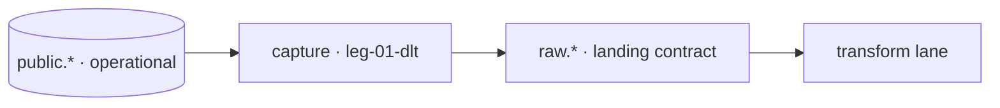

# Swimlane · capture

lane-meta: thread=yes · risk=high · owner=data-platform

FORK: B (task-driven) — Pass 4 consensus reached (cross-family adversary, kimi/moonshot); the seam contracts are settled, so this backbone decomposes to per-unit task-specs at Pass 5B.

Component **A · Capture** — feed the operational source into the backbone without
adding analytical load. Input contract: `public.*` (operational, GIVEN, frozen).
Output contract: `raw.*` (the landing contract the transform lane consumes).

> **This is the swimlane PRD — a lean INDEX over the legs.** Full detail lives in
> each `swimlane-capture-leg-NN-<tech>.md`. Black-box altitude only — no SQL, no evals.

## Seam

Where this lane cuts: **above the operational source, below the landing contract.**
`public.*` is given/frozen — capture never reaches below the committed row and never
into `_control` (ADR 0001, the fence). Downstream reads `raw.*` only. The dependency
is one-way; the interface on the seam is the `raw.*` change-record contract.

## Seam contract · `raw.*` change-record (sharpened — Pass 4)

The one interface on this seam, pinned so transform's dedup is deterministic and
replay is safe. Contract shapes, not SQL — black-box altitude holds.

- **Grain.** One row per *source change event* (append-only) — NOT per current row.
- **Business key.** The source primary key per domain (`<domain>_id`), carried
  verbatim — the identity transform dedups and joins on.
- **Total order / dedup key.** `_lsn` (Postgres WAL LSN, monotonic per source) is
  the order of record; `_source_committed_at` (commit time) is the human-readable
  tiebreak. Dedup = keep the **max-`_lsn`** event per business key. WAL LSN is
  unique, so ties cannot occur and the surviving row is deterministic. *(Decision —
  dedup ordered by WAL LSN per ADR 0002 log-based capture; VP may override the
  order field.)*
- **Op type.** `_op ∈ {insert, update, delete}`. A `delete` is a **tombstone**
  (business columns null, key present); max-`_lsn`-wins means a trailing delete
  removes the entity downstream. No op is dropped at capture.
- **Freshness lineage seed.** Every row carries `_captured_at` (capture as-of) and
  `_source_committed_at` (source commit). These are the seed the gold freshness
  watermark is computed from (transform's contract) — they never disappear.
- **Idempotency / replay.** Capture is replayable from a WAL **checkpoint (LSN)**.
  Re-reading re-emits events with identical `(business key, _lsn)` — exact
  duplicates that collapse under max-`_lsn` dedup, so at-least-once delivery + dedup
  = **effectively-once**. Backfill = replay from an earlier checkpoint; never a
  truncate.

## Architecture



Step-by-step:

1. dlt reads the operational change stream off the Postgres WAL, on a distinct capture principal.
2. leg-01 lands ONE domain end-to-end (the steel thread); leg-02 fattens to all four.
3. leg-03 measures freshness (p99) + by-principal load; `raw.*` hands off to transform.

## Non-Goals

- No transforms or business modeling — that is the transform lane (ADR 0001 forbids reading below the seam).
- No change to the operational system beyond the read principal (W-1).
- No `_control` capture — ever (ADR 0001, the fence).

## Legs — index (full detail in each file)

| Leg | Responsibility (one line) | File |
|---|---|---|
| **leg-01-dlt** | steel-thread anchor — capture principal + one domain end-to-end | [swimlane-capture-leg-01-dlt.md](swimlane-capture-leg-01-dlt.md) |
| **leg-02-dlt** | land all four domains into `raw.*` with per-row as-of / lag | [swimlane-capture-leg-02-dlt.md](swimlane-capture-leg-02-dlt.md) |
| **leg-03-dagster** | freshness (p99) + by-principal-load instrumentation | [swimlane-capture-leg-03-dagster.md](swimlane-capture-leg-03-dagster.md) |

Stable keys: `swimlane-capture-leg-01/02/03` — the `<tech>` suffix is a swappable label.

## Dependencies

```
public.*  ->  leg-01  ->  leg-02  ->  leg-03  ->  raw.*
```

## Build order

1. **leg-01** — the steel thread; nothing is proven until one domain reaches an answer end-to-end.
2. **leg-02** — fatten to all four domains once the thin path holds.
3. **leg-03** — instrument freshness + load against the SLAs.

Gating input: the distinct capture principal (ADR 0003) must exist before any by-principal measurement (R-2 / R-5).

## Open questions

| # | Item | Owner | Blocks build? |
|---|---|---|---|
| Q1 | The by-principal seam (ADR 0003) does not exist on the source yet. | data-platform | **Yes** — blocks R-2/R-5 (leg-03) |
| Q2 | Capture tool: log-based per ADR 0002; the pick is a reversible stack decision. | data-platform | No |

## Spec traceability

- **R-1 · R-2 · R-5** and **ADR 0001 · 0002 · 0003** — grounded per leg; see each leg file.
