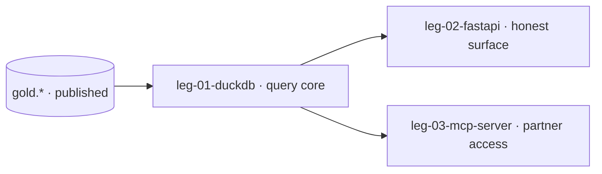

# Swimlane · serve

lane-meta: thread=no · risk=med · owner=analytics-eng

FORK: B (task-driven) — Pass 4 consensus reached (cross-family adversary, kimi/moonshot); the seam contracts are settled, so this backbone decomposes to per-unit task-specs at Pass 5B.

Component **C · Serve** — expose gold as honest, fast answers.
Input contract: `gold.*` (the published contract from transform). Output contract:
`answers` (the serving surface partners and internal consumers query).

> **This is the swimlane PRD — a lean INDEX over the legs.** Full detail lives in
> each `swimlane-serve-leg-NN-<tech>.md`. Black-box altitude only — no query bodies, no evals.

## Seam

Where this lane cuts: **above the published contract, below the answer surface.**
`gold.*` is consumed from transform; `answers` is served. One-way; serve reads only
`gold.*` and never below it into silver / `raw.*` / the source (ADR 0001).

## Architecture



Step-by-step:

1. DuckDB reads the published `gold.*` contract, contract-only, never below the seam.
2. leg-02 exposes answers carrying as-of freshness + the staleness alert.
3. leg-03 opens partner/agent access with the SLA classes over the shared core.

## Non-Goals

- No transforms or re-derivation — serve reads published gold only (ADR 0001).
- No reads below the seam (silver / `raw.*` / source).
- No writes to the operational system.

## Legs — index (full detail in each file)

| Leg | Responsibility (one line) | File |
|---|---|---|
| **leg-01-duckdb** | read-only query core over `gold.*` | [swimlane-serve-leg-01-duckdb.md](swimlane-serve-leg-01-duckdb.md) |
| **leg-02-fastapi** | honest answer surface (as-of + staleness alert) | [swimlane-serve-leg-02-fastapi.md](swimlane-serve-leg-02-fastapi.md) |
| **leg-03-mcp-server** | partner access + SLA classes | [swimlane-serve-leg-03-mcp-server.md](swimlane-serve-leg-03-mcp-server.md) |

Stable keys: `swimlane-serve-leg-01/02/03` — the `<tech>` suffix is a swappable label.

## The interface this lane consumes (the seam — hard boundary)

This lane reads **only the `gold.*` published contract**, never below it.

| upstream unit | fields consumed | read by (leg) |
|---|---|---|
| `gold.*` serving tables | the published columns per question | swimlane-serve-leg-01 |

**Seam evolution:** additive columns on `gold.*` are non-breaking; a rename/removal is
BREAKING and needs a coexistence window. Transform keeps a consumer-driven contract
test green for the columns serve reads.

## Seam contract · reads `gold.*` + freshness/snapshot (sharpened — Pass 4)

- **Consumes.** The published `gold.*` columns per question **plus** the per-table
  freshness watermark `gold_as_of` (transform's contract publishes it).
- **Staleness alert (R-4).** Serve computes `staleness = now − gold_as_of` and
  raises the honest-answer alert when it exceeds the R-4 SLA; the answer carries its
  own `as_of`. This is the consumer end of the freshness lineage seeded at capture
  (`_source_committed_at` → `gold_as_of`) — no as-of is invented at serve.
- **Snapshot isolation (no torn reads).** Serve pins **one DuckLake snapshot per
  logical answer** — the snapshot is resolved once at the start of a single API
  request (leg-02) or a single MCP call (leg-03) and every read for that answer uses
  it, so a multi-table answer never spans snapshots. A concurrent transform publish
  (atomic snapshot swap) is picked up only on the *next* answer.
- **Replay / backfill.** Serve is **stateless over `gold.*`** — a transform
  republish (new snapshot) needs no serve-side reconciliation; the next session
  reads the newer snapshot and its higher `gold_as_of`.

## Dependencies

```
gold.*  ->  leg-01  ->  leg-02  ->  leg-03
```

## Build order

1. **leg-01** — the read-only core the surface and transports share.
2. **leg-02** — freshness / honesty on top of the core.
3. **leg-03** — SLA classes + partner onboarding once answers are honest.

Gating input: the frozen `gold.*` contract gates leg-01.

## Open questions

| # | Item | Owner | Blocks build? |
|---|---|---|---|
| Q1 | The on-call owner named in the R-4 alert lives in the Pass 6 runbook. | ops | No |

## Spec traceability

- **R-3 · R-4 · R-7 · R-8/9 · R-10 · R-11** and **ADR 0001** — grounded per leg.
