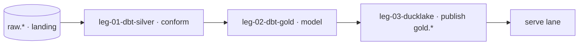

# Swimlane · transform

lane-meta: thread=no · risk=med · owner=analytics-eng

Component **B · Transform** — shape the landed data into answerable gold.
Input contract: `raw.*` (the landing contract from capture). Output contract:
`gold.*` (the published contract the serve lane consumes).

> **This is the swimlane PRD — a lean INDEX over the legs.** Full detail lives in
> each `swimlane-transform-leg-NN-<tech>.md`. Black-box altitude only — no model SQL, no evals.

## Seam

Where this lane cuts: **above the landing contract, below the published contract.**
`raw.*` is consumed from capture; `gold.*` is published for serve. One-way; transform
never reaches back into `public.*` or the source (that is capture's job).

## Architecture



Step-by-step:

1. dbt conforms `raw.*` to silver (dedup, types, UTC grain) on DuckDB.
2. dbt models the gold metrics (revenue = captured, transitive joins) against the ADRs.
3. gold is published as DuckLake tables shaped to the frozen Q-SET-1; `gold.*` hands off to serve.

## Non-Goals

- No capture — the feed is capture's job (transform reads only `raw.*`).
- No serving surface — that is the serve lane.
- No net-of-refunds revenue in v1 base (ADR 0004 pins base revenue = captured).

## Legs — index (full detail in each file)

| Leg | Responsibility (one line) | File |
|---|---|---|
| **leg-01-dbt-silver** | conform `raw.*` to silver (dedup, types, UTC) | [swimlane-transform-leg-01-dbt-silver.md](swimlane-transform-leg-01-dbt-silver.md) |
| **leg-02-dbt-gold** | model the gold metrics (revenue, transitive joins) | [swimlane-transform-leg-02-dbt-gold.md](swimlane-transform-leg-02-dbt-gold.md) |
| **leg-03-ducklake** | publish `gold.*` shaped to Q-SET-1 | [swimlane-transform-leg-03-ducklake.md](swimlane-transform-leg-03-ducklake.md) |

Stable keys: `swimlane-transform-leg-01/02/03` — the `<tech>` suffix is a swappable label.

## The interface this lane consumes (the seam — hard boundary)

This lane reads **only the `raw.*` landing contract**, never back into `public.*`.

| upstream unit | fields consumed | read by (leg) |
|---|---|---|
| `raw.*` change records | committed business columns + capture as-of | swimlane-transform-leg-01 |

**Seam evolution:** additive columns on `raw.*` are non-breaking; a rename/removal is
BREAKING and needs a coexistence window. Capture keeps a consumer-driven contract test
green for the columns transform reads.

## Dependencies

```
raw.*  ->  leg-01  ->  leg-02  ->  leg-03  ->  gold.*
```

## Build order

1. **leg-01** — conform first; nothing models on unconformed raw.
2. **leg-02** — the metrics on the conformed silver.
3. **leg-03** — publish gold once the metrics answer the frozen questions.

Gating input: the frozen Q-SET-1 gates leg-03.

## Open questions

| # | Item | Owner | Blocks build? |
|---|---|---|---|
| Q1 | Net-of-refunds revenue: a metric question the ADRs don't settle. | analytics-eng | No |

## Spec traceability

- **R-3** and **ADR 0002 · 0004 · 0005 · 0006** — grounded per leg.
